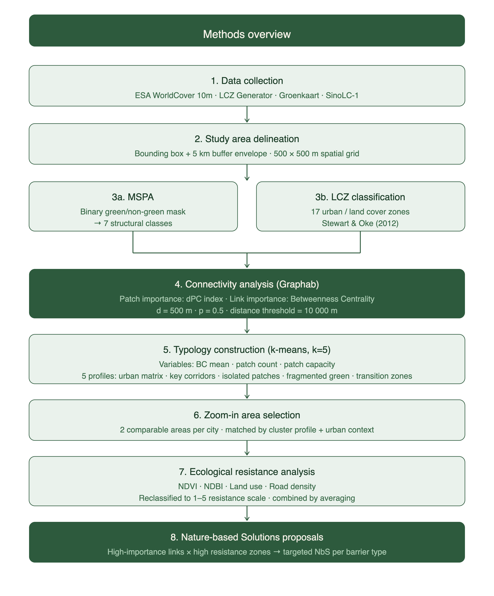
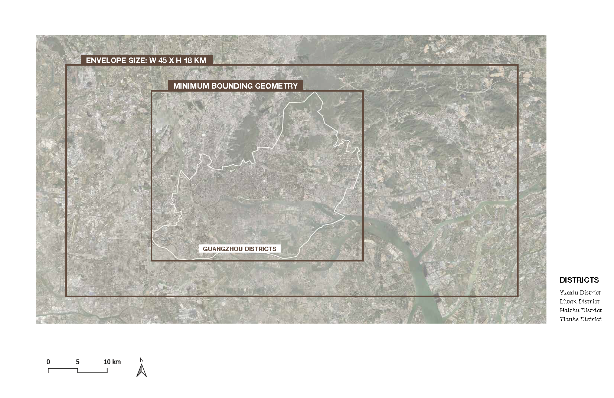
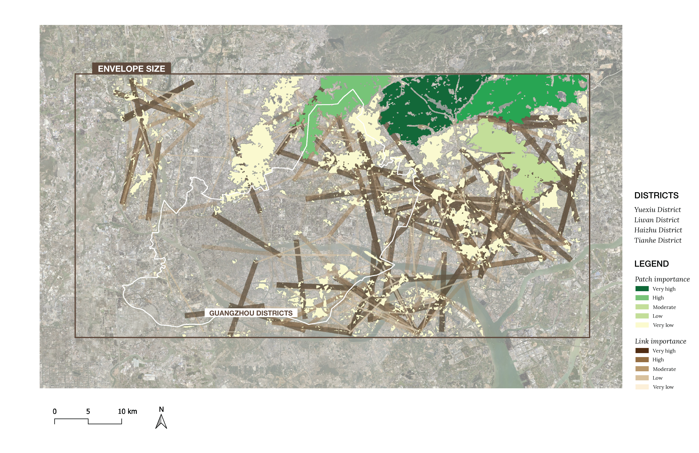
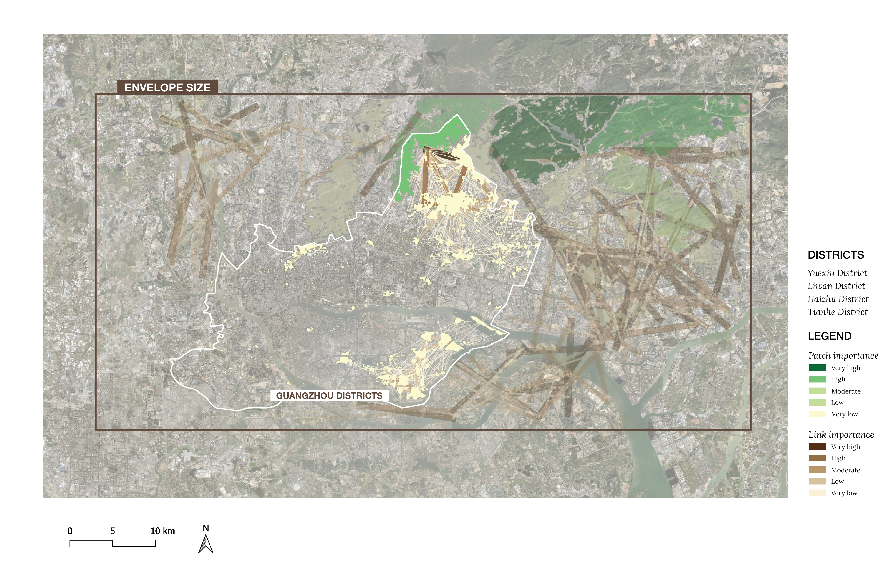
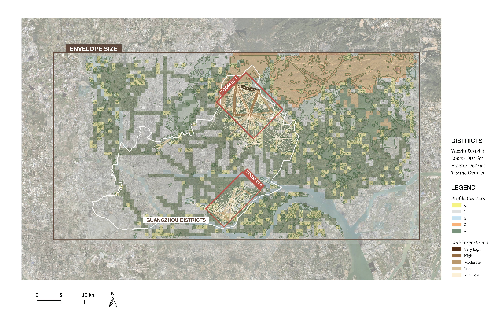
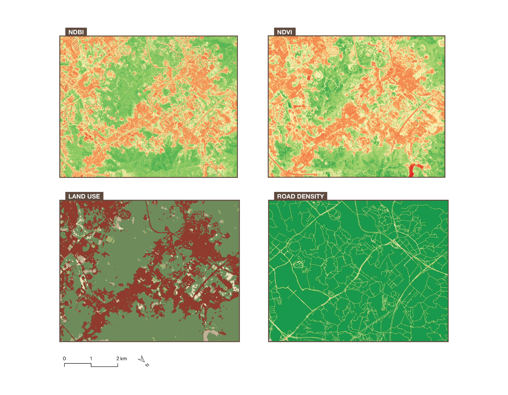
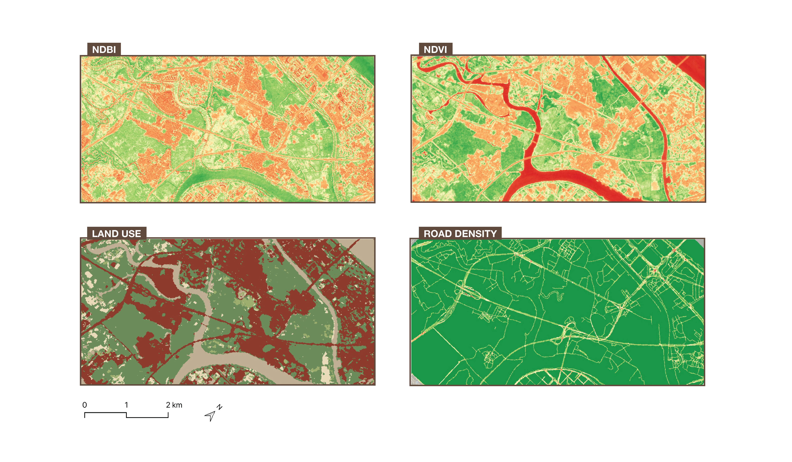
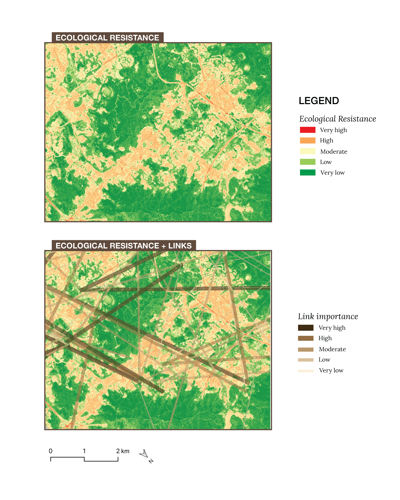
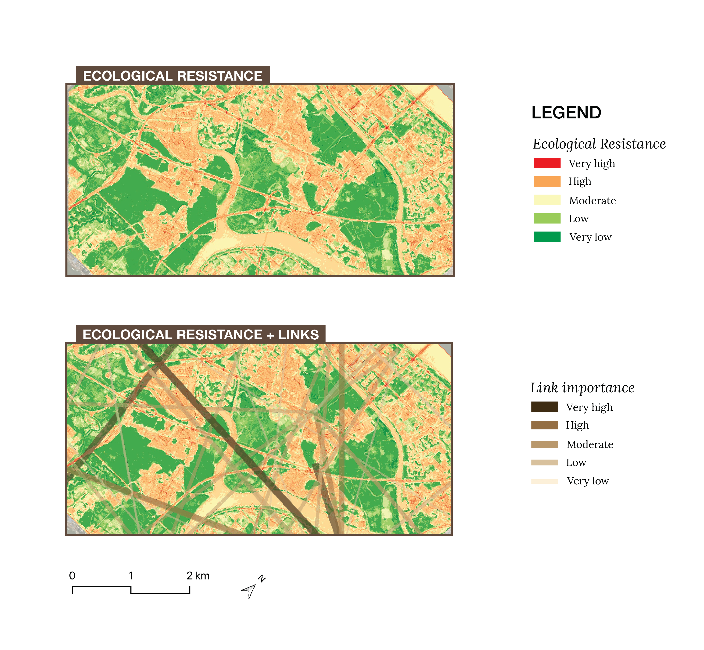

```{r}
#| label: setup
#| include: false

# Installs any missing packages automatically, then loads them.
# This runs once per render — no manual action needed.

required_packages <- c("sf", "dplyr", "tidyr", "knitr")
missing_packages <- required_packages[!required_packages %in% installed.packages()[, "Package"]]
if (length(missing_packages) > 0) {
  install.packages(missing_packages)
}

library(sf)
library(dplyr)
library(tidyr)
library(knitr)
```


## Introduction

Urban ecology is a critical issue in rapidly urbanizing regions (Braaker et al., 2017). Cities are not only built environments for people but also habitats and movement corridors for many plant and animal species. As urban development intensifies, planners must consider how this change affects biodiversity, habitat quality, and ecological connectivity (IUCN Urban Alliance, 2021).  Ecological connectivity describes how easily species can move across a landscape, taking into account how features like habitat patches either support or hinder their movement (Kirk et al., 2023).  

This issue is especially important in delta cities, where dense urban growth often happens in ecologically sensitive landscapes (Wu et al., 2021). Delta cities face issues such as flooding risk, land subsidence, habitat fragmentation, and declining ecosystem services, which can be amplified by climate change and  further urban development (Wu et al., 2021). In the Pearl River Delta, where the city of Guangzhou is situated, rapid urban sprawl and high-intensity human activity have been linked to habitat-quality decline over time, showing how urbanization can gradually harm nature in delta regions (Wu et al., 2021). Rotterdam is another clear example of a delta city where urban form and ecology are tightly connected. As a city in the Rhine-Meuse estuary, Rotterdam faces similar environmental and planning challenges (Dolman & Verlinde, 2024).

Nature-based solutions can aid in addressing ecological connectivity in urban and delta landscapes. Measures such as green corridors, parks, tidal edges, and restored waterways can improve their state (Mollashahi et al., 2020). 

While previous studies have shown that urban sprawl can reduce habitat quality and that nature-based solutions can support resilience (Wu et al., 2021), less attention has been paid to how these approaches interact in delta cities in comparative  urban studies. More research is needed to assess how and where nature-based interventions help in restoring ecological systems in different urban settings.
 This study addresses this gap through the following research question:

> *To what extent does green infrastructure connectivity vary across urban areas 
> in delta cities Rotterdam and Guangzhou, and what does this imply for targeted 
> Nature-based Solutions?*

The main objective of this research is to develop an informed Nature-based Solutions 
plan tailored to spatially comparable areas in both cities. 
The objective is explored and pursued using following steps: (1) assessing the current status of ecological connectivity using betweenness centrality and patch connectivity 
analysis; (2) identifying comparable areas across both cities based on a 
multi-criteria clustering approach combining Local Climate Zones, connectivity 
metrics, and patch characteristics; (3) conducting a deeper spatial analysis of 
these comparable areas; and (4) proposing targeted Nature-based Solutions for them.

This report is structured as follows. Section 2 introduces the two case study cities, Rotterdam and Guangzhou, and describes the datasets used. Section 3 outlines the methods, while sections 4 and 5 present the results for Rotterdam and Guangzhou respectively. Section 6 compares the findings across both cities and identifies comparable study areas. Section 7 proposes targeted Nature-based Solutions for each zoom-in location based on the identified barriers. The report concludes with a discussion of limitations, conclusions and recommendations for further research. 


## Case Study Area

This research focuses on two case studies: one in the Netherlands and one in China. The Dutch study area is the port city of Rotterdam; in China, Guangzhou was chosen. To get a better understanding of the current ecological state in both cities, we looked for datasets that map green spaces in each urban environment. For Rotterdam, we used the "Groenkaart," developed by the Rijksinstituut voor Volksgezondheid en Milieu (RIVM) (Atlas Leefomgeving, 2024). This map shows the locations of green vegetation across the Netherlands, including trees, shrubs, and plants, and distinguishes between different types of green areas, such as agricultural land, nature, and urban green space, to show how green cover is distributed across the country.

Since Guangzhou is much larger in scale, we could not find a map with a comparable resolution and level of detail that would remain readable at the city scale, so we used an alternative instead. SinoLC-1, a 1-meter-resolution national-scale land-cover map of China, gave us a clear picture of where green areas are located at the city level. @fig-introduction-pair presents both maps. As shown in the map of Guangzhou on the right, the main distinction is between tree cover (dark green) and built environment (dark orange). A more detailed breakdown of the classifications and legend can be found in Li et al. (2023), but for the purposes of this stage, this level of detail was sufficient. Together, both maps give us a general understanding of each area before we zoom in for deeper analysis.

- add infor about different sizes of the cities, population etc. 

::: {#fig-introduction-pair layout-ncol=2}
{#fig-roffa}

{#fig-guang}

General introduction of cities.
:::


## Methods
@fig-methodology provides an overview of the methodological workflow followed 
in this study. The analysis consists of eight steps, moving from data collection 
and study area delineation through ecological connectivity analysis, typology 
construction, and zoom-in area selection, to a final ecological resistance 
analysis and the proposal of targeted Nature-based Solutions. Each step is 
described in detail in the sections below.

{#fig-methodology width=100%}

### Data
### Data
notes: 
ESA WorldCover 10m v200 - https://developers.google.com/earth-engine/datasets/catalog/ESA_WorldCover_v200#bands
The European Space Agency (ESA) WorldCover 10 m 2021 product provides a global land cover map for 2021 at 10 m resolution based on Sentinel-1 and Sentinel-2 data. The WorldCover product comes with 11 land cover classes and has been generated in the framework of the ESA WorldCover project, part of the 5th Earth Observation Envelope Programme (EOEP-5) of the European Space Agency. 

LCZ maps for Rotterdam and Guangzhou were obtained from  the LCZ Generator 
(https://lcz-generator.rub.de/global-lcz-map)

#### Envelope
When collecting data, running analyses, and producing maps, it is important to look slightly beyond our area of interest. This is especially relevant when considering ecological connections, since important elements could lie outside our extent. To make sure we capture the surroundings of our area of interest, we therefore decided to create an envelope that extends beyond our bounding box.

For both Rotterdam and Guangzhou, we created a minimum bounding geometry around the shape of the city or municipality. This function can be found in the Processing Toolbox in QGIS, under "Vector Geometry." As shown in @fig-envelope-roffa, this creates an envelope around the maximum extent of the shape. To capture some additional surrounding area, we then added a 5 km buffer around this bounding box (Vector > Geoprocessing Tools > Buffer). This buffered envelope defines the study area used throughout the project.

{#fig-envelope-roffa width=100%}

Add same thing voor Guanzhou:
{#fig-envelope-intro width=100%}

#### Spatial Grid  {#sec-spatialgrid}

A regular spatial grid of 500 × 500 m cells was constructed for each city in QGIS software (Vector Research Tools → Create Grid), covering the set envelope boundary of each city. The grid was created specifically for the typology 
construction process, providing a consistent spatial unit for aggregating and comparing data layers. 

A cell size of 500 × 500 m was chosen to match the dispersal distance parameter (d = 500 m) used in the Graphab connectivity analysis (see @sec-patches). The same distance ensures that each cell somewhat corresponds to the spatial scale at which ecological connectivity is assessed, making the typology meaningful in relation to the crucial connectivity metrics.

#### Local Climate Zones
In order to make a comparable the description of urban morphology across both cities, the Local Climate Zone (LCZ) classification scheme developed by Stewart and Oke (2012) was used. The classification identfies 17 zones based urban on surface structure (e.g. building and tree height and density) and surface cover (pervious versus impervious). 

The LCZ typology is a universal urban classification it focuses specifically on urban and rural landscape types, distinguished through 10 built types (ranging from compact high-rise to heavy industry) and 7 land cover types (ranging from dense trees to water). Its main advantage lies in the diversity of urban classes, which are easily interpretable and globally consistent. 


@fig-lczrt and @fig-lczgz below, depict the distribution of Local Climate Zones in the choosen Cities. 

{#fig-lczrt}

{#fig-lczgz}

### Ecological Connectivity Analysis


#### Morphological Spatial Pattern Analysis {#sec-mspa}


Morphological Spatial Pattern Analysis (MSPA) is a series of mathematical image processing steps that help in understanding the shape and connectivity of different parts within an image. It was developed at the EU Joint Research Centre to describe the geometry and connectivity of the certain pattern in a binary image (Soille & Vogt, 2009) (European Commission Joint Research Centre, n.d.). Every pixel is assigned to one of seven structural classes: Core, Islet, Perforation, Edge, Loop, Bridge, and Branch. Together they describe how connected, isolated, or marginal each part of the explored pattern is.

In this application, Core represents the interior of large patches of green infrastructure; Islet depicts small, isolated fragments with no core area; Perforation marks the margin of an opening or gap within a larger patch; Edge is the outer boundary zone where a patch meets the surrounding urban areas; Bridge and Loop describe narrow, corridor  structures connecting two separate core areas or looping back into the same one; and Branch is narrow, dead-end attached to only one core area.

Since MSPA requires a binary foreground/background input, the first step was to derive such a mask from the ESA WorldCover v200 land-cover product (10 m resolution), which classifies the land surface into eleven categories: tree cover, shrubland, grassland, cropland, built-up, bare/sparse vegetation, snow/ice, permanent water bodies, herbaceous wetland, mangroves, and moss/lichen. This reclassification was carried out in Google Earth Engine, where the WorldCover layer was reclassified so that ecologically relevant classes (tree cover, shrubland, grassland, cropland, herbaceous wetland, and mangroves) were assigned a value of 1 (foreground), while built-up land, bare/sparse vegetation, permanent water bodies and snow/ice were assigned a value of 0 (background, representing the non-ecological matrix). The resulting binary raster was exported as a GeoTIFF and imported into QGIS for the MSPA analysis itself.

The MSPA analysis was performed in QGIS using the MSPA plugin from the European Commission's Forest Joint Research Centre. 

Three parameters are used in MSPA segments. Foreground connectivity, which determines whether diagonally touching pixels count as connected, was set to 8-connectivity rather than 4-connectivity, since ecological movement (animals) is not restricted to the four directions. Edge width, which sets the thickness of the buffer zone separating core area from the surrounding matrix, was set to 5 pixels; at WorldCover's 10 m resolution this corresponds to a 50 m buffer. Transition, which determines whether bridge or loop pixels passing through an edge or perforation to a core area are shown separately, was switched on.


#### Patches and Link Importance (through Graphab) {#sec-patches}

To conduct the ecological connectivity analysis, the software of Grapnhab is used. Graphab is a software program devoted to the modelling of habitat networks using graph-theoretical approaches (Graphab, n.d.). Graph theory provides a simple solution for unifying and evaluating multiple aspects of habitat connectivity, because it can be applied at patch and landscape levels, and it quantifies either structural or functional connectivity (Minor & Urban, 2008). A graph network is represented by a set of nodes and edges, where the nodes are the individual elements within a network (the patches), and edges represent the connectivity between the nodes (links). Graphab combines the construction and visualization of graphs, with subsequent connectivity analyses and links with external geographical or biological data.

By loading the .tiff file created by the MSPA analysis, Graphab can read the landcover classification and filter on those accordingly. We filtered on land use code “17” to select the core areas as habitat patches, Graphab then created a linkset to visualise all the possible connections between each habitat patch (to later use for the calculations).

After loading everything into Graphab, we then continued by making use of the weighted metrics. To understand the importance of each patch and link, two different metrics are used. Before you can run metrics calculations, you first need to create a graph. While creating the graph, we selected the linkset along with a distance threshold (by doing this, it only kept the links within this threshold). For the selected areas in Rotterdam and Guangzhou, multiple distances were tested to understand which number would give a meaningful result. With a short distance, it would result into giving too much importance to smaller links, but with a distance that is too large, it would not take the smaller links into consideration as much. We therefore landed on a value of 10 000m. 

For the patches, delta Probability of Connectivity Index (dPC) was used. dPC measures how much overall connectivity (PC) drops when you remove a patch (Metro Vancouver, 2025). It is a metric that measures the individual contribution of a specific habitat patch to the overall connectivity of the landscape. It represents the change in the PC index when a particular patch is removed, thereby assessing the importance of that patch in maintaining landscape connectivity. This metric is composed of three components: dPCintra, a measure of intrapatch connectivity, dPCconnect, the importance of a patch for connecting other patches together, and dPCflux, a measure of how connected a patch is to the network. The sum of these fractions equals the total delta Probability of Connectivity. This calculation was sadly only available for patches in Graphab, so for the links a different metric was used.

The links were classified through Betweenness Centrality (BC). It counts how many patch-to-patch routes pass through each link (Estrada & Bodin, 2008). It's defined per element and works cleanly on edges, giving a differentiated value for every link: which "potential" connections act as the busiest throughways/bridges. It is a measure of how frequently a node appears on the shortest paths between pairs of other nodes in a network. Together, they formed a complete picture revealing the critical habitats and the critical corridors between them. In our research, they are used as two complementary connectivity metrics, each appropriate to its element type.

For both metrics, the parameters dispersal distance (d) and probability (p) are needed to compute the calculations. Both refer to the chance of an animal moving from one patch to another, based on the distance between the patches, and the dispersal characteristics of the selected animal species (Estreguil et al., 2014). During this research, a specific animal species is not be identified, so therefore we took a dispersal distance of 500 m. This is a common default for urban green infrastructure studies. It represents medium-mobility species and also roughly matches human walking distance to green space. It’s considered good for general urban ecology assessments. The probability starts at a default of 0.5, meaning “at 500 m, there is a 50% chance of successful dispersal”. This is again a standard assumption since we don’t specify species.

After the calculations are computed, each patch and each link now contained dPC and BC values that can be categorised and visualised in QGIS. Here, the patches are visualised through a graduated symbology from green to yellow, where dark green marks a higher value. With five classes on equal intervals, the patches are ordered in importance. Dark green therefore means that once this patch would be removed, it would impact the overall connectivity the most. The links are filtered on the 500 most important ones for each city (by selecting the 500 links with the highest BC value). They are then also visualised though a graduated symbology, this time on line thickness as well as colour. The thicker and darker the lines appear, the busiest the link appears to be in the network. Here however, all links would provide a big impact, since they are filtered on the 500 most important ones.

In the Results (@sec-result-ecoconnect-roffa and @sec-result-ecoconnect-gz), the outcome of this analysis for Rotterdam and Guangzhou is presented, which will be used as one of the inputs for the clustering analysis in the next section.

#### Typology Construction
After Patches and Link Importance analysis and MSPA, it is possible to develop typologies based on their outcomes for broader understanding of ecological connectity and urban/green matrix in both cities. Typology is a classification of areas based on shared combinations of characteristics (source here). To identify spatial character of ecology and its connectivity in Rotterdam and Guangzhou, a typology was constructed for both cities using the same set of variables and spatial unit, allowing direct quantitative comparison between the two cities. 

To construct this typology, two crucial aspects need to be defined: the variables used to characterise each area, and the spatial unit at which these variables were measured. The variables used were Local Climate Zones, ecological connectivity (betweenness centrality), and green patch characteristics, as these together capture both the urban characteristics and the ecological functioning of an area.
The spatial unit used was a fixed-size grid of 500 × 500 m cells (see @sec-spatialgrid). A fixed grid was used because it allows different variables to be aggregated and compared. 

This typology serves as a broad ecological overview of both cities that summarises, at a coarse spatial resolution, where green connectivity is strong, where it is weak or absent, and what kind of green structure dominates each area. It is not intended to pinpoint specific intervention sites, but  to provide the wider ecological context which enables more detailed analyses performed further. Combined with the MSPA and patch/link importance results (@sec-results-ecoconnect), this typology was used to guide the selection of the smaller zoom-in study areas examined in more detail later in this report.


##### Clustering 

All three criteria for typologies were summarised per grid cell. Betweenness centrality values were spatially joined to the grid using an intersection, with the mean normalised BC value computed per cell. Green patch metrics (patch count and mean patch capacity, derived from the dPC field) were similarly joined to the grid. Grid cells with no links or patches passing through them were assigned a value of zero, since they simply have no green connectivity (this is not missing data but a meaningful absence).

Before clustering, the three numeric variables (BC mean, patch count, and mean patch capacity) were standardised using z-score normalisation to ensure equal weighting regardless of original scale. K-means clustering (k = 5) was then applied to these three standardised variables. Clustering was implemented as a reusable function in R, executed directly within the reproducible Quarto report, so that cluster assignments regenerate automatically whenever the report is rendered.
Because K-means assigns cluster numbers arbitrarily, each resulting cluster was subsequently classified according to its own ecological profile into: Disconnected urban fabric (lowest combined patch presence and capacity, i.e. no meaningful green network), Key corridors (highest betweenness centrality), Isolated quality patches (highest patch capacity), Fragmented green (highest average patch count), and Transition zones (the remaining profile). This classification step ensures that cluster identities, labels, and map colours remain consistent both within and across cities, and across repeated renders of the report, regardless of the raw numbering K-means happens to produce on a given run.

After clustering, the dominant LCZ classes per cluster were checked separately to understand what kind of urban environment each cluster is typically located in. For each cluster, the three most common LCZ classes were identified, since a single dominant class rarely captures the full urban context of a 500 × 500 m cell. LCZ was deliberately excluded from the clustering input itself, since it is a categorical variable and including its numeric codes directly would have distorted the Euclidean distances used by K-means.

The function below implements the clustering pipeline describedabove. It standardises the betweenness centrality, patch count, patch capacity, and LCZ variables, then applies K-means clustering with five clusters. The same function is applied separately to Rotterdam and Guangzhou in the results section.


```{r}
#| label: clustering-function

cluster_grid <- function(gpkg_path, bc_col, patch_count_col, patch_cap_col, lcz_col,
                          role_to_id, role_to_color, k = 5, seed = 42) {
  grid <- st_read(gpkg_path, quiet = TRUE)

  # NA means "no links/patches passing through this cell" — treat as 0
  grid <- grid |>
    mutate(across(all_of(c(bc_col, patch_count_col, patch_cap_col)), ~ replace_na(.x, 0)))

  features <- grid |>
    st_drop_geometry() |>
    select(all_of(c(bc_col, patch_count_col, patch_cap_col)))

  X_scaled <- scale(features)

  set.seed(seed)
  km <- kmeans(X_scaled, centers = k, nstart = 20)
  raw_cluster <- km$cluster

  # Classify each raw kmeans cluster by its profile
  raw_profile <- data.frame(
    raw_id   = 1:k,
    bc_mean  = as.numeric(tapply(grid[[bc_col]], raw_cluster, mean)),
    patches  = as.numeric(tapply(grid[[patch_count_col]], raw_cluster, mean)),
    capacity = as.numeric(tapply(grid[[patch_cap_col]], raw_cluster, mean))
  )

  remaining <- raw_profile
  role_assignment <- character(k)
  names(role_assignment) <- as.character(raw_profile$raw_id)

  # 1. Urban matrix: lowest combined patches + capacity (no green presence)
  urban_id <- remaining$raw_id[which.min(remaining$patches + remaining$capacity)]
  role_assignment[as.character(urban_id)] <- "Urban matrix"
  remaining <- remaining |> filter(raw_id != urban_id)

  # 2. Key corridors: highest BC among what's left
  corridor_id <- remaining$raw_id[which.max(remaining$bc_mean)]
  role_assignment[as.character(corridor_id)] <- "Key corridors"
  remaining <- remaining |> filter(raw_id != corridor_id)

  # 3. Isolated quality patches: highest capacity among what's left
  isolated_id <- remaining$raw_id[which.max(remaining$capacity)]
  role_assignment[as.character(isolated_id)] <- "Isolated quality patches"
  remaining <- remaining |> filter(raw_id != isolated_id)

  # 4. Fragmented green: highest patch count among what's left
  fragmented_id <- remaining$raw_id[which.max(remaining$patches)]
  role_assignment[as.character(fragmented_id)] <- "Fragmented green"
  remaining <- remaining |> filter(raw_id != fragmented_id)

  # 5. Whatever's left
  role_assignment[as.character(remaining$raw_id)] <- "Transition zones"

  # Remap to fixed, city-specific ID and color scheme ---
  grid$cluster_role  <- role_assignment[as.character(raw_cluster)]
  grid$cluster_id    <- role_to_id[grid$cluster_role]
  grid$cluster_color <- role_to_color[grid$cluster_role]

  profile <- grid |>
    st_drop_geometry() |>
    group_by(cluster_id, cluster_role) |>
    summarise(
      n        = n(),
      bc_mean  = round(mean(.data[[bc_col]]), 4),
      patches  = round(mean(.data[[patch_count_col]]), 2),
      capacity = round(mean(.data[[patch_cap_col]]), 4),
      .groups  = "drop"
    ) |>
    arrange(cluster_id)

  lcz_summary <- grid |>
    st_drop_geometry() |>
    group_by(cluster_id) |>
    count(.data[[lcz_col]], sort = TRUE) |>
    slice_max(n, n = 3, with_ties = FALSE)

  list(grid = grid, profile = profile, lcz_summary = lcz_summary)
}
```

```{r}
#| label: cluster-id-scheme

# Same five colors used by both cities
role_to_color <- c(
  "Transition zones"        = "lightblue",
  "Key corridors"            = "darkgreen",
  "Urban matrix"             = "gray70",
  "Isolated quality patches" = "orange",
  "Fragmented green"         = "yellow"
)

# Rotterdam
rt_role_to_id <- c(
  "Transition zones"        = 0,
  "Key corridors"            = 1,
  "Urban matrix"             = 2,
  "Isolated quality patches" = 3,
  "Fragmented green"         = 4
)

# Guangzhou (different order!)
gz_role_to_id <- c(
  "Fragmented green"         = 0,
  "Urban matrix"             = 1,
  "Transition zones"         = 2,
  "Isolated quality patches" = 3,
  "Key corridors"             = 4
)
```

```{r}
#| label: lcz-labels

lcz_labels <- c(
  "1"  = "LCZ 1 – Compact high-rise",
  "2"  = "LCZ 2 – Compact mid-rise",
  "3"  = "LCZ 3 – Compact low-rise",
  "4"  = "LCZ 4 – Open high-rise",
  "5"  = "LCZ 5 – Open mid-rise",
  "6"  = "LCZ 6 – Open low-rise",
  "7"  = "LCZ 7 – Lightweight low-rise",
  "8"  = "LCZ 8 – Large low-rise",
  "9"  = "LCZ 9 – Sparsely built",
  "10" = "LCZ 10 – Heavy industry",
  "11" = "LCZ A – Dense trees",
  "12" = "LCZ B – Scattered trees",
  "13" = "LCZ C – Bush, scrub",
  "14" = "LCZ D – Low plants",
  "15" = "LCZ E – Bare rock or paved",
  "16" = "LCZ F – Bare soil or sand",
  "17" = "LCZ G – Water"
)
```


### Study Area Selection
Comparable study areas between Rotterdam and Guangzhou were identified by matching clusters across both cities based on similarities in their BC values, patch characteristics, and LCZ composition. Two pairs of zoom in areas were chosen for  each city. 

### Ecological Resistance
After selecting 2 study areas within each city a deeper analysis is performed to investigate barriers to ecological connectivity as well as potentials for improvement. Especially for understanding how to implement "potential" links, it's important to take the context into account. The graph theory showcases a simplified version of reality, but all the barriers such as roads, train tracks, rivers, and many others, are not yet taken into account.

- add here what will be investigated (4 metrics and how we combine them)

#### NDVI
- -1.0 to 0: Non-vegetated surfaces like clouds, snow, or open water.
- 0 to 0.1: Bare soil, rock, roads, or urban infrastructure.
- 0.2 to 0.5: Sparse or stressed vegetation, grasslands, or crops.
- 0.6 to 1.0: Dense, healthy vegetation such as mature forests or crops at peak growth.
(source)


#### NDBI
- ">" 0: Likely built-up or urban areas.
- ≈ 0: Bare soil or mixed terrain.
- < 0: Vegetation (which reflects highly in NIR) or water bodies.
(source)
 

#### Land Use
1-5 scale 
1 - low: trees/shrub
2 - low-moderate: grass/wetland
3 - moderate: cropland
4 - moderate-high:bare/water
5 - high: built-up 
(source)

#### Road Density
parameters:
search radius: Radius of the circular neighbourhood (in meters). - 10m
pixel size:Pixel size of the output raster layer in layer units(in meters).-10m
(source)


#### Combining the layers

To combine all resistance layers and get a good representation of the overall ecological resistance, some extra preprocessing was needed. Each of the four input layers, NDVI, NDBI, land cover, and road density, was originally on a different value scale. For the case of Rotterdam, NDVI ranged from -0.2 to 0.8, NDBI from -0.5 to 0.5, road density from 0 to 0.15 km/km², while the land cover resistance was already classified from 1 to 5. Averaging these raw values directly would produce meaningless results, since the scales are incompatible and the ecological direction of the values differs between layers (high NDVI indicates low resistance, while high NDBI indicates high resistance). 

Each layer was therefore reclassified into a standardised 1-to-5 ecological resistance scale using equal-interval breakpoints derived from the value range of each layer, where 1 represents the lowest resistance to species movement and 5 the highest. In the QGIS Raster Calculator, this was implemented as a conditional sum, where each condition evaluates to 0 or 1, ensuring every pixel is assigned to exactly one class:

(layer >= threshold₄) × 1 + (layer >= threshold₃ AND layer < threshold₄) × 2 + (layer >= threshold₂ AND layer < threshold₃) × 3 + (layer >= threshold₁ AND layer < threshold₂) × 4 + (layer < threshold₁) × 5

The four thresholds were calculated as min + n × (range / 5) for n = 1 through 4, dividing each layer's value range into five equal intervals. For example, NDBI with a range of -0.5 to 0.5 produces thresholds at -0.3, -0.1, 0.1, and 0.3, assigning resistance classes 1 through 5 from lowest to highest built-up intensity. After reclassification and clipping to the study area boundary, the four layers were combined by averaging them in the QGIS Raster Calculator (adding them up and then dividing by four), producing a continuous ecological resistance surface ranging from 1 to 5. This was done for both zoom in areas in both cities, which was then overlaid with the initial “potential” links. 


## Results Rotterdam {#sec-results-roffa}
### Current Ecological Connectivity Status {#sec-results-ecoconnect}

#### Morphological Spatial Pattern Analysis (MSPA)

After running the MSPA analysis (@sec-mspa) on the Rotterdam envelope area and analysing the distribution of classes, the green network (Core, Islet, Perforation, Edge, Loop, Bridge, Branch) covers 45.77%  of it, while background (the non-green matrix: Background, Core-Opening, Border-Opening) 54.23%.  

@fig-MSPArt shows large green cores, but this is partly because the foreground includes a broad set of land cover classes (Tree, Shrubland, Grassland, Cropland, Wetland, and Mangroves), so some of these cores may not be fully representative of high-quality ecological habitat. 

This is a useful basis for the patch and link importance analysis that follows (@sec-result-ecoconnect-roffa). The green patches should not be treated as equally meaningful nodes. MSPA analysis is dominated by small cores like the tail-like fragments (likely isolated street trees, small gardens and other small green elements. They are numerous but contribute negligibly to the total core area and are unlikely to be significant habitats on their own. However, these fragments could still matter as stepping stones for connectivity. This supports running the patch and link importance analysis specifically on the dominant core patches, since they are the backbone of the green network. Moreover, two smaller study areas within the city are also examined more closely, using metrics like NDVI, NDBI, road density, and land-cover resistance, to assess habitat quality and connectivity in more detail than the broader MSPA classification alone can provide. 


{#fig-MSPArt}


#### Patches and Link Importance {#sec-result-ecoconnect-roffa}

To represent the ecological connectivity, the layers are split into the patches and links. For the patches, the most essential elements of the green structure are visualised in dark green and less important elements in lighter shades leading up to yellow. Higher importance in this case means that if this patch were to be removed, the connectivity of the entire network would suffer the most. Patches with higher importance can’t be supported by the surrounding green structure, meaning a greater loss in network connectivity. By focusing on an envelope around the boundary of Rotterdam, we get to include more context that would’ve been lost otherwise. This envelope shape sadly still cuts off the surrounding patches, so some patches appear smaller within this shape and in the overall connectivity therefore also score less. This is a limitation of the envelope approach, but it did help in reducing the computation time so we take this in consideration.

The same visualisation is done for the links, where a darker and thicker brown represents the most important “potential” links in the network. It is interesting to see that most of the links don’t run into the boundary of Rotterdam. Since the patches around the city are much bigger and get more importance, the links span around the boundary rather than within. From this analysis, it then shifts the focus on a link outside of the city boundary, but then we would lose the urban area factor that is central in our research. That’s why we chose to run the metric again but this time only within the boundary of Rotterdam, to understand which parts of the patches then become crucial and where meaningful interventions could happen in the urban environment.

{#fig-connectivity-renvelope width=100%}

{#fig-connectivity-rboundary width=100%}

As can be seen in @fig-connectivity-rboundary, we can now identify spaces within the boundary of Rotterdam that could be improved. These, together with some additional analysis on clustering, will then form the basis of choosing the zoom in locations.

#### Cluster Profiles

K-means clustering of Rotterdam's grid cells produced five ecological 
profiles. Table X presents the mean values per cluster for betweenness centrality, 
patch count, and patch capacity.

```{r}
#| label: rt-clustering

rt <- cluster_grid(
  "data/rt_grid_clustering.gpkg",
  bc_col          = "new_normal",
  patch_count_col = "dpc_total_",
  patch_cap_col   = "dpc_tota_2",
  lcz_col         = "majortity_lcz_grid__majority",
  role_to_id      = rt_role_to_id,
  role_to_color   = role_to_color
)

kable(rt$profile, caption = "Rotterdam cluster profiles")

```

Cluster 2 (Urban matrix) is the largest group in Rotterdam (n = 3,175, around 47% of all grid cells), representing areas with no meaningful green network (neither patches nor betweenness centrality are present in these cells). Cluster 1 (Key corridors) is the smallest (n = 83) but the most ecologically significant.  These are key corridor locations, combining the highest betweenness centrality of any cluster (BC mean = 0.6243) with moderate-to-high patch capacity. Cluster 3 (Isolated quality patches, n = 497) captures high-quality green patches that are poorly connected to the wider network  (the lowest BC but the highest patch capacity). Cluster 4 (Fragmented green, n = 759) represents fragmented green space: cells here contain multiple small, low-capacity patches (2.21 per cell on average) with minimal connectivity. Cluster 0 (Transition zones, n = 2,266) is a lower-density version of fragmented green (typically a single small, low-quality patch per cell with weak connectivity) situated  between the urban matrix and the more clearly green-dominated clusters (look at map…). 


```{r}
#| label: rt-lcz

rt$lcz_summary |>
  mutate(lcz_label = lcz_labels[as.character(majortity_lcz_grid__majority)]) |>
  arrange(cluster_id, desc(n)) |>
  group_by(cluster_id) |>
  mutate(rank  = paste0("Rank ", row_number()),
         entry = paste0(lcz_label, " (n=", n, ")")) |>
  ungroup() |>
  select(cluster_id, rank, entry) |>
  pivot_wider(names_from = rank, values_from = entry) |>
  arrange(cluster_id) |>
  kable(caption = "Top LCZ classes per Rotterdam cluster")
```

The dominant LCZ classes per cluster depict a clear contrast between Rotterdam's green network and its urban matrix. LCZ D (Low plants) is the most common class in every cluster except the Urban matrix (including the Key corridors cluster (75 of 83 cells), the Transition zones cluster (1,104 cells), the Isolated quality patches cluster (347 cells), and the Fragmented green cluster (299 cells)). This indicates that nearly all of Rotterdam's green connectivity network runs through open, low-vegetation land such as grassland and polder. The Urban matrix cluster stands apart entirely: its top classes are LCZ 8 (Large low-rise, 476 cells) and LCZ 6 (Open low-rise, 367 cells); which are pure built environments.
A few secondary classes point to where Rotterdam's denser tree cover sits. The Isolated quality patches cluster is the only one with a meaningful presence of LCZ A (Dense trees, 37 cells), suggesting its highest-capacity green patches include some  wooded areas alongside open vegetation. The Fragmented green cluster shows the strongest secondary presence of LCZ B (Scattered trees, 107 cells), consistent with a patchwork of small green elements that includes some tree cover rather than open land alone.


##### Spatial Distribution

```{r}
#| label: rt-map
#| fig-cap: "Rotterdam — spatial distribution of clusters"
#| fig-width: 9

par(mar = c(1, 1, 1, 9))  # extra right-hand margin reserved for the legend
plot(st_geometry(rt$grid), col = rt$grid$cluster_color, border = NA, main = NULL)
legend(x = par("usr")[2], y = par("usr")[4],
       legend = names(role_to_color), fill = role_to_color,
       cex = 0.8, bty = "n", xpd = NA)
```

The spatial distribution map depicts that the isolated quality patches cluster forms one large, contiguous zone in the southwest of Rotterdam (with the open, low-vegetation polder landscape identified in the LCZ analysis). The Key corridors cluster runSdirectly along its southern edge, its only substantial concentration anywhere in the study area. The remainder of the map is dominated by a mix of Urban matrix cells interspersed with Transition zones and Fragmented green, with no further concentrations of either Isolated quality patches or Key corridors elsewhere in Rotterdam. 

## Results Guangzhou {#sec-results-gz}
### Current Ecological Connectivity Status {#sec-results-ecoconnect2}

#### Morphological Spatial Pattern Analysis (MSPA)

After running the Morphological Spatial Pattern Analysis on Guangzhou's envelope area (Section 4.2.1) and analysing the distribution of classes, the overall result is similar to Rotterdam, though slightly less green-dominated. The backround covers the majority of the evenelope's area accounting for 58.19% as opposed to the overall green network (Core, Islet, Perforation, Edge, Loop, Bridge, Branch) covering 41.81% (approximately 4% lower than Rotterdam).@fig-MSPAgz highlights a large and continuous green network in the North part of the envelope with majority of the cores located there. As with Rotterdam, these areas include a number of different types of vegetation, however trees (value 10) are the most dominant ones.  

{#fig-MSPAgz}


#### Patches and Link Importance {#sec-result-ecoconnect-gz}

{#fig-connectivity-first width=100%}

{#fig-connectivity-second width=100%}


#### Cluster Profiles
K-means clustering of Guangzhou's grid cells produced five ecological 
profiles. Table X presents the mean values per cluster for betweenness centrality, 
patch count, and patch capacity.

```{r}
#| label: gz-clustering

gz <- cluster_grid(
  "data/gz_grid_clustering.gpkg",
  bc_col          = "bc_d500_p0.5_beta1_graph10000_mean",
  patch_count_col = "dpc_sum_count",
  patch_cap_col   = "dpc_sum_mean",
  lcz_col         = "lcz_majority_grids_lcz__majority",
  role_to_id      = gz_role_to_id,
  role_to_color   = role_to_color
)

kable(gz$profile, caption = "Guangzhou cluster profiles")
```

Guangzhou's clustering reveals a different ecological pattern from Rotterdam. Cluster 1 (urban matrix, n = 1,502) has no patches and no connectivity, which is comparable in role to Rotterdam's largest cluster (also urban matrix). However, it is proportionally much smaller (about 31% of cells here, versus 47% in Rotterdam) which reflects Guangzhou's denser green network. Cluster 4 (Key corridors, n = 1,455) and Cluster 0 (Fragmented green, n = 760) both show high betweenness centrality (BC mean around 0.41–0.43), indicating that high-connectivity corridors are far more widespread in Guangzhou than in Rotterdam. Cluster 0 combines high BC with the highest average patch count of any cluster (3.00 per cell), suggesting fragmented but well-connected green space. Cluster 3 (Isolated quality patches, n = 406) is the clearest cross-city match: like Rotterdam's equivalent, it shows the highest patch capacity of any Guangzhou cluster (0.4227) alongside comparatively low BC (0.0588). Cluster 2 (Transition zones, n = 713) shows a low-quality green presence with weak connectivity.


```{r}
#| label: gz-lcz

#| label: gz-lcz

gz$lcz_summary |>
  mutate(lcz_label = lcz_labels[as.character(lcz_majority_grids_lcz__majority)]) |>
  arrange(cluster_id, desc(n)) |>
  group_by(cluster_id) |>
  mutate(rank  = paste0("Rank ", row_number()),
         entry = paste0(lcz_label, " (n=", n, ")")) |>
  ungroup() |>
  select(cluster_id, rank, entry) |>
  pivot_wider(names_from = rank, values_from = entry) |>
  arrange(cluster_id) |>
  kable(caption = "Top LCZ classes per Guangzhou cluster")
```

In Guangzhou, the Isolated quality patches cluster is dominated by LCZ A (Dense trees, 351 of 406 cells — 86%), proving it to be a forest rather than open vegetation. The Transition zones cluster is also led by LCZ A (Dense trees, 186 cells), though more evenly mixed with LCZ 6 (Open low-rise, 175 cells) and LCZ 8 (Large low-rise, 175 cells), suggesting a blend of wooded and low-rise built contexts.
The Key corridors cluster is dominated by LCZ 8 (Large low-rise, 541 cells) and LCZ 4 (Open high-rise, 239 cells), with LCZ A (Dense trees, 205 cells). This is a notable contrast with Rotterdam, where the equivalent Key corridors cluster ran almost entirely through LCZ D (open, low-vegetation land); in Guangzhou, the busiest ecological corridors instead cut through dense, large low-rise and high-rise urban fabric, implying these links function more as built-environment green threads than open-landscape pathways. The Fragmented green cluster follows the same built-dominated pattern, led by LCZ 6 (Open low-rise, 346 cells) and LCZ 8 (Large low-rise, 218 cells), with no tree-cover class appearing in its top three at all.


##### Spatial Distribution

```{r}
#| label: gz-map
#| fig-cap: "Guangzhou — spatial distribution of clusters"
#| fig-width: 9

par(mar = c(1, 1, 1, 9))
plot(st_geometry(gz$grid), col = gz$grid$cluster_color, border = NA, main = NULL)
legend(x = par("usr")[2], y = par("usr")[4],
       legend = names(role_to_color), fill = role_to_color,
       cex = 0.8, bty = "n", xpd = NA)
```

The spatial distribution map shows the Isolated quality patches cluster forms a single, large block in the north of the study area, consistent with the dense, forested LCZ A landscape identified in the LCZ analysis. Unlike Rotterdam, where the key corridors cluster formed one narrow line along the edge of the isolated patches, Guangzhou's Key corridors cluster forms an extensive, web-like network spanning most of the lower two-thirds of the study area, intertwined with fragmented green cells. This reflects Guangzhou's much larger high-connectivity network, running primarily through the built urban fabric. The urban matrix cluster and transition zones cells fill the remaining gaps, more concentrated toward the southwestern part of the envelope.

## Comparing Results {#sec-results-comp}

### Comparable Study Areas

Two pairs of comparable areas were identified based on similarity in ecological 
connectivity profiles and urban context. 

Rather than matching individual clusters one-to-one between cities, comparable 
study areas were identified by examining the spatial distribution of cluster 
types within each city's own grid. In both cities, the isolated quality 
patches cluster (high-capacity green space with weak connectivity) was used 
as the starting point, since it represents the clearest opportunity for targeted connectivity intervention: ecologically valuable green space that is 
currently disconnected from the wider network. The immediate surroundings of 
these patches were examined to understand what type of green (or absence of 
it) borders them. 


### Zoom Ins Rotterdam

@fig-zoomin-roffa presents the two zoom-in locations selected for Rotterdam, chosen for their comparability. The context of the two tiles, however, is very different: zoom-in 1 focuses on a heavily industrialised area at the Port of Rotterdam, while zoom-in 2 examines a neighbourhood situated at the boundary of the municipality. The additional analysis conducted on these smaller tiles is presented in the next section.

{#fig-zoomin-roffa width=100%}


also this has to be edited: 
Here we see that the orange cluster showing good quality patches with weak connectivty is surrounded mostly by framgmented low quality greens (cluster 2) and some 0 clusters (Transition zones — moderate connectivity, some patches) and there is some green (cluster 1), which indicate a small but significant presence of key corridors with very high BC and quality patches. This depict potential that the cluster 1 could be expanded (by leverging parts of orange cluster or connecting yellow areas (also improving their quality) around it. But then when looking at the whole ecological profile of rotterdam there are not any mor eorange clusters withing the area, which could motivate the second intervention (on yellow clusters with id 2) in other areas (maybe top right corner of the envelope). 


study area 1 has 22647834,561 m2 and second has 36012716,54162598 m2.  

#### Ecological Resistance

##### NDVI

The min-max you had : -0.2 to 0.8 values
##### NDBI
The min-max you had : -0.5 to 0.5 values 
##### Land Use
##### Road Density
The min-max you had : 0 to 0,15

##### NDBI
##### Land Use
##### Road Density


{#fig-ecores-roffa1 width=100%}

{#fig-ecores-roffa2 width=100%}

##### Conclusion Maps

After combining all layers, the barriers facing each "potential" link become clear. As shown in the bottom map of each figure, some "potential" links already follow an existing green corridor or element; from this stage onward, we therefore focus only on the missing links.

In zoom-in 1, the dominant barrier is the Nieuwe Waterweg, a key shipping channel serving the Port of Rotterdam. The thinner barriers in this area are also waterways, reflecting its role as part of the Europoort of Rotterdam. When developing NBS in the next step, this industrial character and port functionality must be taken into account.

Zoom-in 2 sits at the edge of the city, where residential neighbourhoods become the focus. The barriers here are correspondingly different: highways, roads, and railway tracks are the obstacles that need to be overcome.

{#fig-ecores-tot-roffa1 width=100%}

{#fig-ecores-tot-roffa2 width=100%}


### Zoom Ins Guangzhou
{#fig-zoomin-gz width=100%}
Figure 16 presents the two zoom-in locations selected for Guangzhou. 
The selection was guided primarily by link importance: areas concentrating 
the highest-importance links (very high and high, visible as the darkest, 
thickest lines on the map) were prioritised, as these represent the most 
critical missing connections in the network. To ensure comparability with 
the Rotterdam zoom-in areas in terms of spatial scale and analytical 
accuracy, the size of each tile was kept consistent with those selected 
for Rotterdam, with district boundaries taken into account when defining 
the extents.

The two zoom-in areas reflect contrasting urban contexts within Guangzhou. 
Zoom-in 1 is located in the northern part of the study area, in the 
Tianhe District, where the landscape transitions toward hillier, more 
vegetated terrain. This area contains a concentration of very high and 
high importance links connecting green patches across a mixed urban-natural 
gradient. Zoom-in 2 is situated further south, in the Haizhu District, 
where the urban character is denser and more built-up. Here, the critical 
links run through a more fragmented urban fabric, presenting a different 
set of barriers and opportunities for Nature-based Solutions compared to 
zoom-in 1. 

#### Ecological Resistance
##### NDVI
##### NDBI
##### Land Use
##### Road Density


{#fig-zoom1-metrics width=100%}

{#fig-zoom2-metrics width=100%}

##### Conclusion Maps
After combining all layers, the barriers facing each "potential" link become clear. As shown in the bottom map of each figure, some "potential" links already follow an existing green corridor or element; from this stage onward, we therefore focus only on the missing links.

In zoom-in 1 (Tianhe District), the overall ecological resistance is predominantly very low to low, reflecting the large and continuous patches of subtropical forest visible in dark green across much of the area. The dominant barriers where the highest-importance links cross are broader zones of moderate to high resistance representing urban fabric — buildings, paved surfaces, and limited vegetation interrupting the otherwise continuous forest matrix. Within these urban zones, red lines indicate that roads add an additional layer of very high resistance. The barrier to connectivity is therefore a combination of urban built fabric and the roads embedded within it. When developing NbS in the next step, this mixed urban-natural character must be taken into account.

Zoom-in 2 (Haizhu District) presents a more fragmented picture, where existing parks with very low resistance are separated by three distinct barrier types clearly visible on the map: a large river channel running diagonally through the area, roads appearing as red lines of very high resistance cutting across the link trajectories, and broader zones of moderate to high resistance representing the dense urban fabric between the parks. The barriers here are correspondingly more varied, and NbS will need to address all three simultaneously.

{#fig-resistance-first width=100%}

{#fig-resistance-second width=100%}

## Nature-based Solutions

To identify where Nature-based Solutions can most effectively improve ecological 
connectivity, the maps combining ecological resistance and link importance 
(Figures 14, 15, 18, 19) were used as the primary analytical basis. For each 
zoom-in area, the links with the highest betweenness centrality were overlaid 
with the combined ecological resistance surface. Where these high-importance 
links cross zones of very high resistance, shown in red on the maps, these 
intersections were identified as the critical barrier locations requiring 
intervention. For each of these locations, the underlying land use was then 
determined, as the nature of the barrier directly defines which NbS are feasible. 
This process was applied consistently across all four zoom-in areas, ensuring 
that the proposed NbS are spatially grounded rather than generically applied, 
and that they reflect the specific urban context of each location, ranging from 
industrial port infrastructure and residential neighbourhoods in Rotterdam to 
mixed urban-natural terrain and dense riverine fabric in Guangzhou.

### Rotterdam: Zoom-in 1

Overlaying the highest-importance links with the combined ecological resistance 
surface in zoom-in area 1 (Figure 14) shows that the most critical link crosses 
zones of very high resistance concentrated around the Nieuwe Waterweg and the 
surrounding port terminal surfaces. Examining the underlying land use reveals 
two distinct barrier types: the open shipping channel of the Nieuwe Waterweg 
itself, and the impervious built-up surfaces of the industrial port infrastructure 
on either side.

For the industrial port surfaces, where high resistance is driven by impervious 
cover and near-absent vegetation, hybrid and adaptive edge solutions are proposed. 
This involves introducing native vegetation along quay edges and installing 
ecological habitat modules on existing hard port infrastructure bordering the link 
corridor. Marzio et al. (2025) identify this approach, retrofitting waterfront 
edges with hybrid green-grey solutions, as one of the three core NbS strategies 
for urban waterfronts, noting that such solutions allow natural processes to 
operate within built environments, providing a flexible approach in 
space-constrained areas without interfering with primary port functions.

For the secondary harbour basins and quieter dock edges along the link corridor, 
constructed floating wetlands (FTWs) are proposed as aquatic stepping stones. 
Rome et al. (2023) demonstrate that FTWs planted with native species provide 
valuable wetland habitat and produce localised improvements in ecological quality 
even at small scales. Critically, Rome et al. (2023) also note that very few 
studies have explored FTWs in active urban waterways that continue to support 
industrial transportation, directly confirming that placement within the main 
Nieuwe Waterweg shipping channel is not feasible. FTWs are therefore proposed 
exclusively for quieter secondary basins, at intervals not exceeding 500 m, 
consistent with the dispersal distance used throughout this study.

The main Nieuwe Waterweg channel itself constitutes a residual hard barrier that 
cannot be addressed through NbS. Active large-vessel navigation makes any 
in-channel intervention physically hazardous and infeasible, and this limitation 
should be acknowledged in broader connectivity planning for Rotterdam.

### Rotterdam: Zoom-in 2

Overlaying the highest-importance links with the combined ecological resistance 
surface in zoom-in area 2 (Figure 15) shows that the most critical links cross 
zones of very high resistance concentrated along a network of roads, highways and 
railway lines running through the residential urban fabric. Unlike zoom-in 1, the 
wider matrix here shows moderate to low resistance, suggesting that the surrounding 
residential area already contains meaningful green elements; the primary 
connectivity problem is the fragmentation caused by these transport corridors 
cutting across the link trajectories.

For the road and railway barriers, two complementary NbS are proposed. First, 
green verges and roadside vegetation enhancement along the transport corridors 
that the critical links cross. Cork et al. (2024) demonstrate in a systematic 
review that road and railway verges in temperate zones have significant potential 
for habitat connectivity, particularly for generalist species, and that verge 
habitat quality and continuity are key determinants of their effectiveness as 
ecological corridors. Enhancing existing verges through native planting, reduced 
mowing regimes, and structural diversification can meaningfully reduce resistance 
along these corridors without requiring major infrastructure changes. Second, for 
locations where the highest-importance links cross major roads or rail lines and 
verge enhancement alone is insufficient, green bridges or crossing structures are 
proposed as a more targeted intervention. Cork et al. (2024) also note that 
successful dispersal across railways requires specific crossing provisions, and 
that such structures are increasingly being integrated into transport 
infrastructure planning as credible NbS alternatives.

For the residential matrix between the transport barriers, where resistance is 
already moderate to low, pocket parks and street tree networks are proposed to 
strengthen connectivity between existing green patches, reducing the effective 
ecological distance between the larger green areas visible in the northwest of 
the zoom-in area and the patches further east.

### Guangzhou: Zoom-in 1

Overlaying the highest-importance links with the combined ecological resistance 
surface in zoom-in area 1 (Figure 18) shows that the overall resistance in the 
Tianhe District is predominantly very low to low, reflecting large and continuous 
patches of subtropical forest. However, the highest-importance links cross several 
broader zones of moderate to high resistance: wider patches of urban fabric with 
buildings, paved surfaces and limited vegetation that interrupt the otherwise 
continuous forest matrix. Within these urban zones, red lines indicate that roads 
add an additional layer of very high resistance. The barrier to connectivity is 
therefore a combination of urban built fabric and the roads embedded within it.

Two complementary NbS are proposed. First, for the roads within the urban fabric, 
vegetated wildlife underpasses are proposed at the specific locations where the 
highest-importance links cross them. As demonstrated for Rotterdam zoom-in 2, 
Cork et al. (2024) confirm that native vegetation at and around crossing structures 
significantly increases their use by wildlife, and that verge continuity guides 
species movement toward crossing points. Given the subtropical forest context, 
underpasses should connect directly to existing forest edge vegetation on both sides.

Second, for the broader urban fabric zones between the forest patches, green roofs, 
green walls and pocket parks are proposed as stepping stone NbS to increase the 
permeability of the urban matrix along the link corridors (@fig-greenroofs). 
Madre et al. (2018) show that green roofs and green walls can function as stepping 
stones in fragmented urban areas, enhancing species dispersal through the urban 
matrix. This is further supported by Joshi & Teller (2021), whose systematic 
review explicitly identifies green roofs as a medium for connecting urban green 
areas, providing potential for habitat connectivity and maintenance of the 
ecological network. Importantly, Joshi & Teller (2021) note that building height 
is a determining factor for biodiversity effectiveness, and call for future 
research to include taller buildings in ecological network analyses, a relevant 
consideration given the high-rise character of parts of the Tianhe urban fabric. 
Green roofs should therefore be prioritised on lower-rise buildings along the 
link trajectory, where their connectivity potential is greatest.

{#fig-greenroofs width=100%}

Together these two interventions address both barrier types: the roads through 
targeted crossing structures, and the urban matrix through a network of 
distributed green stepping stones.

### Guangzhou: Zoom-in 2

Overlaying the highest-importance links with the combined ecological resistance 
surface in zoom-in area 2 (Figure 19) reveals a fragmented landscape where 
existing parks (very low resistance, dark green) are separated by three distinct 
barrier types: a large river channel running diagonally through the area, roads 
visible as red lines of very high resistance, and broader zones of moderate to 
high resistance representing dense urban fabric between the parks.

Three complementary NbS are proposed. First, for the river channel and its banks, 
riparian vegetation restoration is proposed along both margins where the critical 
links cross the waterway. Machado & Kim (2024) demonstrate that restoring native 
riparian vegetation along urban stream corridors directly improves ecological 
quality and connectivity function, creating a continuous vegetated margin that 
allows species to move parallel to and across the waterway via existing bridges 
and culverts.

Second, for the roads where very high resistance is visible as red lines, 
vegetated road verges and crossing enhancements are proposed, as previously 
described for Rotterdam zoom-in 2 and Guangzhou zoom-in 1 (Cork et al., 2024), 
at the specific locations where critical links intersect them.

Third, for the broader urban fabric zones of moderate to high resistance between 
the parks, green roofs and green walls are proposed as stepping stone NbS along 
the link trajectories. As described for Guangzhou zoom-in 1 (Madre et al., 2018; 
Joshi & Teller, 2021), these interventions increase the permeability of the urban 
matrix along the critical link corridors. The connectivity potential of green roofs 
is particularly strong in Haizhu given its relatively low-rise urban fabric 
compared to Tianhe, since Joshi & Teller (2021) specifically note that lower 
buildings support more effective biodiversity outcomes from green roof 
implementation.

Together these three interventions directly target all identified resistance 
barriers, the river, the roads, and the urban matrix, along the trajectories of 
the highest-importance links connecting the existing park patches.

###Concluding NbS table 

| City | Zoom-in | Barrier (Land Use) | Proposed NbS | Advantages | Disadvantages | Source |
|------|---------|-------------------|--------------|------------|---------------|--------|
| Rotterdam | 1 — Port area | Impervious port surfaces | Hybrid green-grey edge retrofitting | Compatible with active port operations; allows natural processes within built infrastructure; flexible in space-constrained areas | Limited landscape-scale ecological impact; dependent on port authority cooperation | Marzio et al. (2025) |
| Rotterdam | 1 — Port area | Secondary harbour basins | Constructed floating wetlands (FTWs) | Creates aquatic stepping stones; improves local water quality; scalable in quiet basins | Not suitable for active shipping lanes; maintenance required; limited terrestrial connectivity | Rome et al. (2023) |
| Rotterdam | 1 — Port area | Nieuwe Waterweg shipping channel | No NbS feasible — residual hard barrier | N/A | Active large-vessel navigation makes any in-channel intervention physically hazardous and legally infeasible | Rome et al. (2023) |
| Rotterdam | 2 — Residential | Roads and railway lines | Green verges and roadside vegetation | No major infrastructure changes needed; cost-effective; immediate resistance reduction | Limited effectiveness for wide or fast roads; dependent on mowing regime policy changes | Cork et al. (2024) |
| Rotterdam | 2 — Residential | Major road/rail crossings | Green bridges and crossing structures | Ecologically effective; benefits wide range of species; largest gain in nature value | High construction costs; cost-effectiveness modest compared to other measures; long implementation timeline | Vos et al. (2020) |
| Rotterdam | 2 — Residential | Residential matrix | Pocket parks and street tree networks | Function as green stepping stones complementing larger parks; cost-effective; improve urban liveability | Small individual ecological impact; require many interventions for meaningful connectivity gain; policy support needed for short-term interventions | Geng et al. (2022); Rosso et al. (2022) |
| Guangzhou | 1 — Tianhe | Roads within urban fabric | Vegetated wildlife underpasses | Allows species movement beneath roads; connects directly to existing forest edges; benefits range of taxonomic groups | Construction disruption; effectiveness depends on species-specific behaviour; requires monitoring | Cork et al. (2024) |
| Guangzhou | 1 — Tianhe | Urban fabric between forest patches | Green roofs, green walls, pocket parks | Stepping stones through built matrix; multiple co-benefits (cooling, stormwater, biodiversity); scalable | Less effective on high-rise buildings; dependent on private building owner cooperation; high installation costs | Madre et al. (2018); Joshi & Teller (2021) |
| Guangzhou | 2 — Haizhu | River channel and banks | Riparian vegetation restoration | Improves water quality and flood attenuation; low cost; creates continuous habitat corridor | Slow establishment; regeneration constrained by propagule availability and invasive species competition; may conflict with existing flood control infrastructure | Machado & Kim (2024); Salinas-García et al. (2025) |
| Guangzhou | 2 — Haizhu | Roads (red lines) | Vegetated road verges and crossing enhancements | Targeted at specific high-resistance points; cost-effective; immediate resistance reduction | Limited by road width and traffic intensity; requires maintenance and policy support | Cork et al. (2024) |
| Guangzhou | 2 — Haizhu | Urban fabric between parks | Green roofs and green walls | Particularly effective given low-rise character of Haizhu; multiple co-benefits | Dependent on private owner uptake; installation costs; limited ground-level connectivity | Madre et al. (2018); Joshi & Teller (2021) |

: Overview of proposed Nature-based Solutions per zoom-in area, including advantages, disadvantages and supporting literature. {#tbl-nbs-overview}

Maybe add here land use -> NbS --> how it fits the land use/its benefits --> source to have all of them for RT and GZ in one place. 

And after it mention that of course it would be most effective to find places such as brownfields - but we did not, or abandoned/unused areas but again, time limitation and scope limitation and the fact that we do not have enough data for GZ to do that. 


## Conclusion

## Discussion
### Conefor vs. Graphab

Limitation of Conefor vs Graphahb, long computation time, time lost, results not as expected...

### Differences and similarities between cities

### Implications for NbS


## Recommendations & Further Research

## Reproducibility Statement

## AI Statement

## Reference List

Atlas Leefomgeving. (2024). Groenkaart van Nederland. 
https://www.atlasleefomgeving.nl/groenkaart-van-nederland

Braaker, S., Kormann, U., Bontadina, F., & Obrist, M. K. (2017). Prediction of genetic connectivity in urban ecosystems by combining detailed movement data, genetic data and multi-path modelling. Landscape and Urban Planning, 160, 107–114. https://doi.org/10.1016/j.landurbplan.2016.12.011

Cork, N. A., Fisher, R. S., Strong, N., Ferranti, E. J. S., & Quinn, A. D. (2024). 
A systematic review of factors influencing habitat connectivity and biodiversity 
along road and rail routes in temperate zones. Frontiers in Environmental 
Science, 12, 1369072. https://doi.org/10.3389/fenvs.2024.1369072

Dolman, N., & Verlinde, J. (2024). Achieving a Water-Resilient Rotterdam: Past, Present and Future Perspectives. Blue Papers, 3(1). https://doi.org/10.58981/bluepapers.2024.1.13

Estrada, E., & Bodin, Ö. (2008). Using network centrality measures to manage 
landscape connectivity. Ecological Applications, 18(7), 1810–1825. 
https://doi.org/10.1890/07-1419.1

Estreguil, C., Caudullo, G., & de Rigo, D. (2014). Connectivity of Natura 2000 
forest sites in Europe. F1000Posters, 5, 485. 
https://doi.org/10.6084/m9.figshare.1063300

European Commission, Joint Research Centre. (n.d.). MSPA. Forest. Retrieved 
June 18, 2026, from https://forest.jrc.ec.europa.eu/en/activities/lpa/mspa/

Graphab. (n.d.). Graphab. 
https://thema.umlp.fr/productions/software/graphab/en/home.html

IUCN Urban Alliance. (2021, April 25). Cities and nature: The issues. https://iucnurbanalliance.org/cities-and-biodiversity-the-issues/

Joshi, M. Y., & Teller, J. (2021). Urban integration of green roofs: Current 
challenges and perspectives. Sustainability, 13(22), 12378. 
https://doi.org/10.3390/su132212378

Kirk, H., Soanes, K., Amati, M., Bekessy, S., Harrison, L., Parris, K., Ramalho, C., van de Ree, R., & Threlfall, C. (2023). Ecological connectivity as a planning tool for the conservation of wildlife in cities. MethodsX, 10, 101989. https://doi.org/10.1016/j.mex.2022.101989

Machado, J. T., & Kim, G. (2024). Ecological landscape assessment of restored 
urban stream to guide adaptive management. Heliyon, 10(13), e33880. 
https://doi.org/10.1016/j.heliyon.2024.e33880

Madre, F., Vergnes, A., Machon, N., & Clergeau, P. (2018). Green roofs and 
green walls for biodiversity conservation: A contribution to urban connectivity? 
Sustainability, 10(4), 985. https://doi.org/10.3390/su10040985

Marzio, S., Tosi, J., Poggi, F., & Amado, M. (2025). Nature-based solutions 
for urban waterfront regeneration: a systematic review of frameworks, strategies 
and applications. City and Environment Interactions, 29, 100281. 
https://doi.org/10.1016/j.cacint.2025.100281

Metro Vancouver. (2025). Evaluation of regional ecosystem connectivity. 
https://metrovancouver.org/services/regional-planning/Documents/evaluation-of-regional-ecosystem-connectivity.pdf

Minor, E. S., & Urban, D. L. (2008). A graph-theory framework for evaluating 
landscape connectivity and conservation planning. Conservation Biology, 22(2), 
297–307. https://doi.org/10.1111/j.1523-1739.2007.00871.x

Mollashahi, H., Szymura, M., & Szymura, T. H. (2020). Connectivity assessment and prioritization of urban grasslands as a helpful tool for effective management of urban ecosystem services. PLOS ONE, 15(12), e0244452. https://doi.org/10.1371/journal.pone.0244452

Rome, M., Happel, A., Dahlenburg, C., Nicodemus, P., Schott, E., Mueller, S., 
Lovell, K., & Beighley, R. E. (2023). Application of floating wetlands for the 
improvement of degraded urban waters: Findings from three multi-year 
pilot-scale installations. Science of the Total Environment, 877, 162669. 
https://doi.org/10.1016/j.scitotenv.2023.162669

Soille, P., & Vogt, P. (2009). Morphological segmentation of binary patterns. 
Pattern Recognition Letters, 30(4), 456–459. 
https://doi.org/10.1016/j.patrec.2008.10.015

Stewart, I. D., & Oke, T. R. (2012). Local climate zones for urban temperature studies. Bulletin of the American Meteorological Society, 93(12), 1879–1900. https://doi.org/10.1175/BAMS-D-11-00019.1

World Urban Database and Access Portal Tools (WUDAPT). (n.d.). Local climate zones. https://www.wudapt.org/lcz/

Wu, J., Li, X., Luo, Y., & Zhang, D. (2021). Spatiotemporal effects of urban sprawl on habitat quality in the Pearl River Delta from 1990 to 2018. *Scientific Reports*, *11*, Article 13981. https://doi.org/10.1038/s41598-021-92916-3

Zhuohong Li, Wei He, Mofan Cheng, Jingxin Hu, Xiao An, Yan Huang, Guangyi 
Yang, & Hongyan Zhang. (2023). SinoLC-1: the first 1-meter resolution 
national-scale land-cover map of China created with the deep learning framework 
and open-access data (User guide V2.4) [Data set]. Zenodo. 
https://doi.org/10.5281/zenodo.8214871
