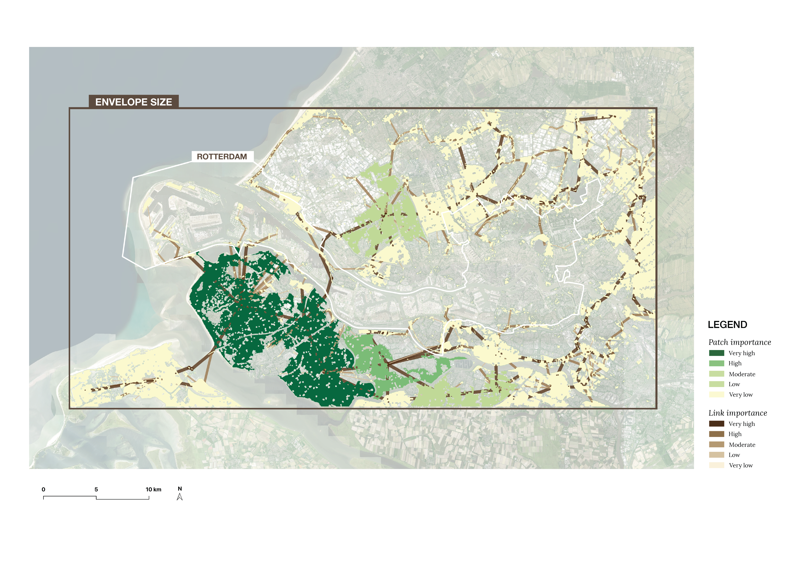
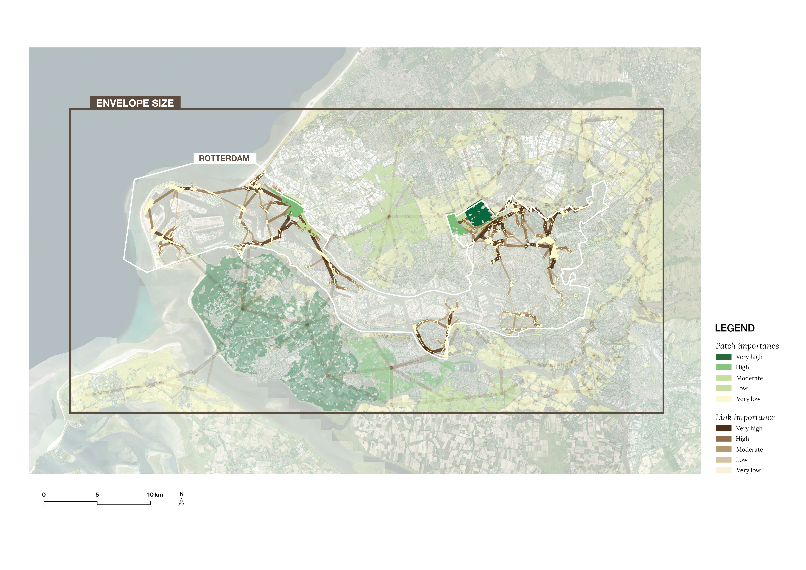
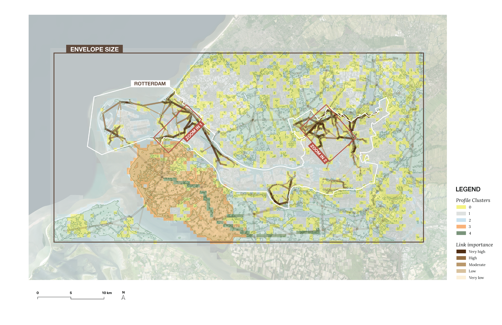
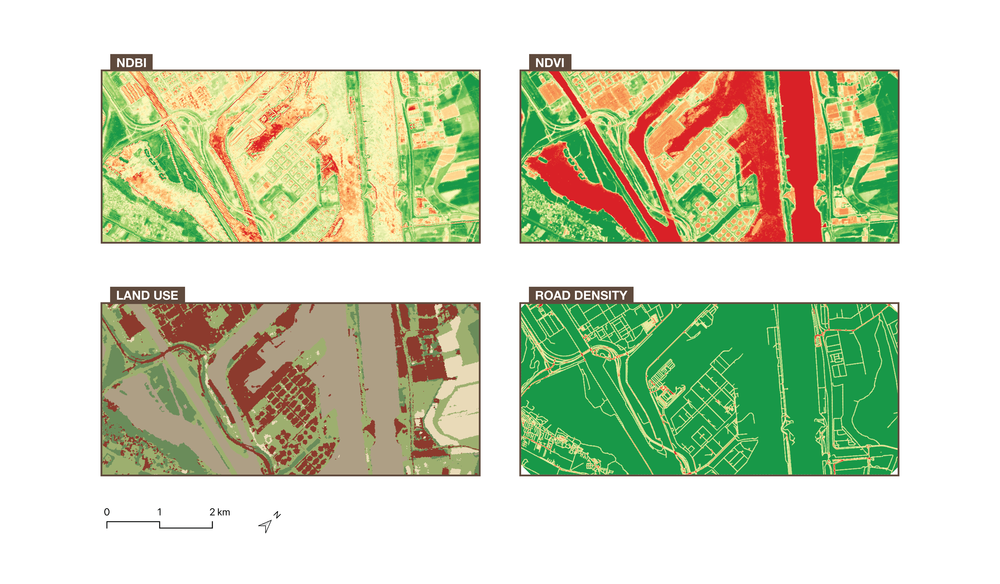
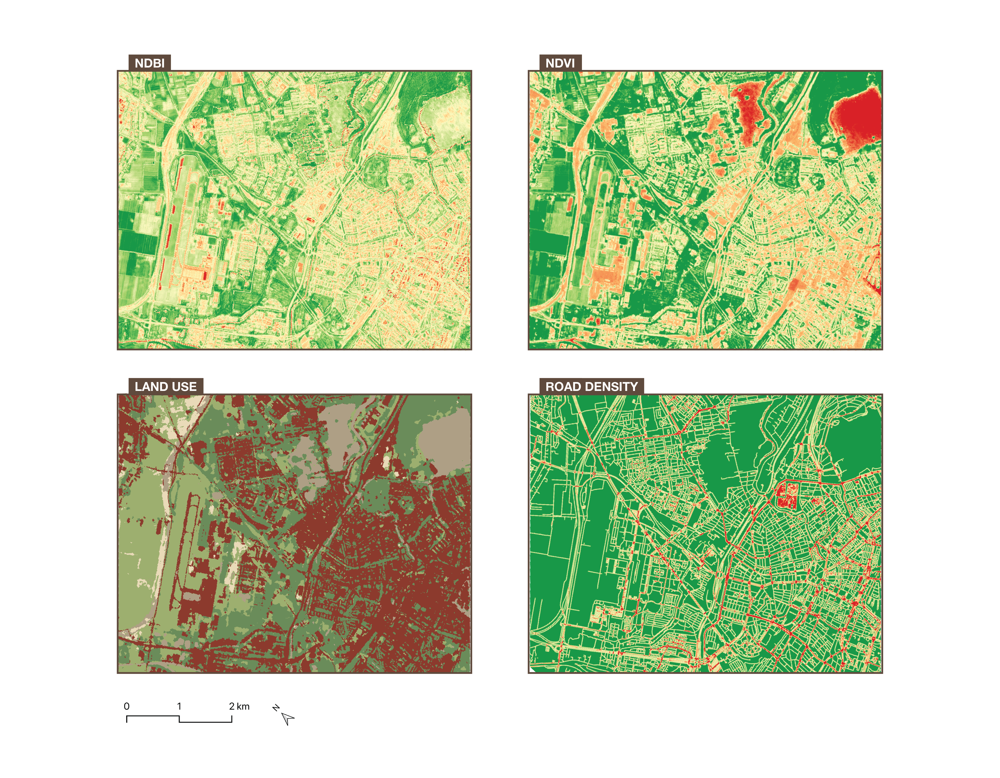
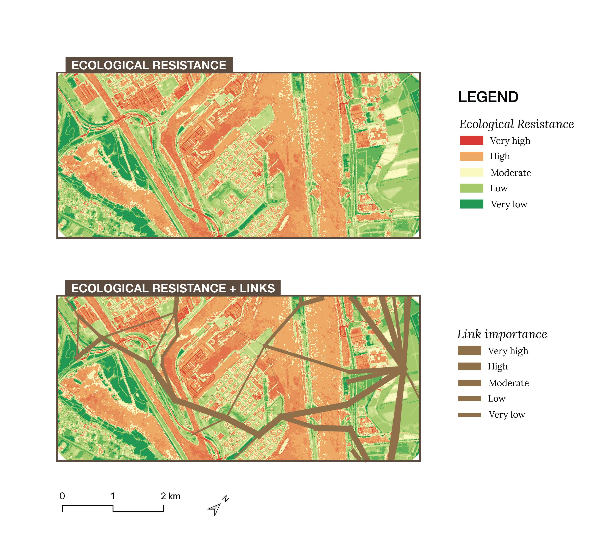
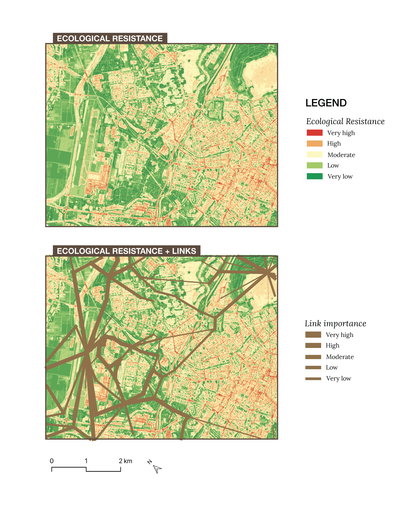

```{r}
#| label: setup
#| include: false

# Installs any missing packages automatically, then loads them.
# This runs once per render — no manual action needed.

required_packages <- c("sf", "dplyr", "tidyr", "knitr")
missing_packages <- required_packages[!required_packages %in% installed.packages()[, "Package"]]
if (length(missing_packages) > 0) {
  install.packages(missing_packages)
}

library(sf)
library(dplyr)
library(tidyr)
library(knitr)
```

::: callout
## This is a computational notebook

Quarto enables you to weave together content and executable code into a finished document. To learn more about Quarto see <https://quarto.org>.

## Running Code

When you click the **Render** button a document will be generated that includes both content and the output of embedded code. You can embed code like this:

```{r}
1 + 1
```

You can add options to executable code like this 

```{r}
#| echo: false
2 * 2
```

The `echo: false` option disables the printing of code (only output is displayed).

You can delete this entire callout between and including the lines
```
::: callout
```
and

```
:::
```
and start the report from the Introduction section below.
:::

## Introduction

Delta cities - will add context on it later

Rotterdam and Guangzhou represent two contrasting delta city contexts. - to be added 

ecological connectivty in delta cities - importance issue etc. - find a research gap 

This study addresses this gap through the following research question:

> *To what extent does green infrastructure connectivity vary across urban areas 
> in delta cities Rotterdam and Guangzhou, and what does this imply for targeted 
> Nature-based Solutions?*

The main objective of this research is to develop an informed Nature-based Solutions 
plan tailored to spatially comparable areas in both cities. 
The objective is explored and pursued using following steps: (1) assessing the current status of ecological connectivity using betweenness centrality and patch connectivity 
analysis; (2) identifying comparable areas across both cities based on a 
multi-criteria clustering approach combining Local Climate Zones, connectivity 
metrics, and patch characteristics; (3) conducting a deeper spatial analysis of 
these comparable areas; and (4) proposing targeted Nature-based Solutions for them.

## Case Study Area

This research focuses on two case studies: one in the Netherlands and one in China. The Dutch study area is the port city of Rotterdam; in China, Guangzhou was chosen. To get a better understanding of the current ecological state in both cities, we looked for datasets that map green spaces in each urban environment. For Rotterdam, we used the "Groenkaart," developed by the Rijksinstituut voor Volksgezondheid en Milieu (RIVM) (Atlas Leefomgeving, 2024). This map shows the locations of green vegetation across the Netherlands, including trees, shrubs, and plants, and distinguishes between different types of green areas, such as agricultural land, nature, and urban green space, to show how green cover is distributed across the country.

Since Guangzhou is much larger in scale, we could not find a map with a comparable resolution and level of detail that would remain readable at the city scale, so we used an alternative instead. SinoLC-1, a 1-meter-resolution national-scale land-cover map of China, gave us a clear picture of where green areas are located at the city level. @fig-introduction-pair presents both maps. As shown in the map of Guangzhou on the right, the main distinction is between tree cover (dark green) and built environment (dark orange). A more detailed breakdown of the classifications and legend can be found in Li et al. (2023), but for the purposes of this stage, this level of detail was sufficient. Together, both maps give us a general understanding of each area before we zoom in for deeper analysis.

- add infor about different sizes of the cities, population etc. 

::: {#fig-introduction-pair layout-ncol=2}
{#fig-roffa}

{#fig-guang}

General introduction of cities.
:::


## Methods
### Data
notes: 
ESA WorldCover 10m v200 - https://developers.google.com/earth-engine/datasets/catalog/ESA_WorldCover_v200#bands
The European Space Agency (ESA) WorldCover 10 m 2021 product provides a global land cover map for 2021 at 10 m resolution based on Sentinel-1 and Sentinel-2 data. The WorldCover product comes with 11 land cover classes and has been generated in the framework of the ESA WorldCover project, part of the 5th Earth Observation Envelope Programme (EOEP-5) of the European Space Agency. 

LCZ maps for Rotterdam and Guangzhou were obtained from  the LCZ Generator 
(https://lcz-generator.rub.de/global-lcz-map)

#### Envelope
When collecting data, running analyses, and producing maps, it is important to look slightly beyond our area of interest. This is especially relevant when considering ecological connections, since important elements could lie outside our extent. To make sure we capture the surroundings of our area of interest, we therefore decided to create an envelope that extends beyond our bounding box.

For both Rotterdam and Guangzhou, we created a minimum bounding geometry around the shape of the city or municipality. This function can be found in the Processing Toolbox in QGIS, under "Vector Geometry." As shown in @fig-envelope-roffa, this creates an envelope around the maximum extent of the shape. To capture some additional surrounding area, we then added a 5 km buffer around this bounding box (Vector > Geoprocessing Tools > Buffer). This buffered envelope defines the study area used throughout the project.

{#fig-envelope-roffa width=100%}

Add same thing voor Guanzhou:

#### Spatial Grid  {#sec-spatialgrid}

A regular spatial grid of 500 × 500 m cells was constructed for each city in QGIS software (Vector Research Tools → Create Grid), covering the set envelope boundary of each city. The grid was created specifically for the typology 
construction process, providing a consistent spatial unit for aggregating and comparing data layers. 

A cell size of 500 × 500 m was chosen to match the dispersal distance parameter (d = 500 m) used in the Graphab connectivity analysis (see @sec-patches). The same distance ensures that each cell somewhat corresponds to the spatial scale at which ecological connectivity is assessed, making the typology meaningful in relation to the crucial connectivity metrics.

#### Local Climate Zones
sources to add :
https://www.wudapt.org/lcz/
https://lcz-generator.rub.de/global-lcz-map
 
In order to make a comparable the description of urban morphology across both cities, the Local Climate Zone (LCZ) classification scheme developed by Stewart and Oke (2012) was used. The classification identfies 17 zones based urban on surface structure (e.g. building and tree height and density) and surface cover (pervious versus impervious). 

The LCZ typology is a universal urban classification it focuses specifically on urban and rural landscape types, distinguished through 10 built types (ranging from compact high-rise to heavy industry) and 7 land cover types (ranging from dense trees to water). Its main advantage lies in the diversity of urban classes, which are easily interpretable and globally consistent. 


@fig-lczrt and @fig-lczgz below, depict the distribution of Local Climate Zones in the choosen Cities. 

{#fig-lczrt}

{#fig-lczgz}

### Ecological Connectivity Analysis

#### Morphological Spatial Pattern Analysis {#sec-mspa}


Morphological Spatial Pattern Analysis (MSPA) is a series of mathematical image processing steps that help in understanding the shape and connectivity of different parts within an image. It was developed at the EU Joint Research Centre to describe the geometry and connectivity of the certain pattern in a binary image (Soille & Vogt, 2009) (European Commission Joint Research Centre, n.d.). Every pixel is assigned to one of seven structural classes: Core, Islet, Perforation, Edge, Loop, Bridge, and Branch. Together they describe how connected, isolated, or marginal each part of the explored pattern is.

In this application, Core represents the interior of large patches of green infrastructure; Islet depicts small, isolated fragments with no core area; Perforation marks the margin of an opening or gap within a larger patch; Edge is the outer boundary zone where a patch meets the surrounding urban areas; Bridge and Loop describe narrow, corridor  structures connecting two separate core areas or looping back into the same one; and Branch is narrow, dead-end attached to only one core area.

Since MSPA requires a binary foreground/background input, the first step was to derive such a mask from the ESA WorldCover v200 land-cover product (10 m resolution), which classifies the land surface into eleven categories: tree cover, shrubland, grassland, cropland, built-up, bare/sparse vegetation, snow/ice, permanent water bodies, herbaceous wetland, mangroves, and moss/lichen. This reclassification was carried out in Google Earth Engine, where the WorldCover layer was reclassified so that ecologically relevant classes (tree cover, shrubland, grassland, cropland, herbaceous wetland, and mangroves) were assigned a value of 1 (foreground), while built-up land, bare/sparse vegetation, permanent water bodies and snow/ice were assigned a value of 0 (background, representing the non-ecological matrix). The resulting binary raster was exported as a GeoTIFF and imported into QGIS for the MSPA analysis itself.

The MSPA analysis was performed in QGIS using the MSPA plugin from the European Commission's Forest Joint Research Centre. 

Three parameters are used in MSPA segments. Foreground connectivity, which determines whether diagonally touching pixels count as connected, was set to 8-connectivity rather than 4-connectivity, since ecological movement (animals) is not restricted to the four directions. Edge width, which sets the thickness of the buffer zone separating core area from the surrounding matrix, was set to 5 pixels; at WorldCover's 10 m resolution this corresponds to a 50 m buffer. Transition, which determines whether bridge or loop pixels passing through an edge or perforation to a core area are shown separately, was switched on.


#### Patches and Link Importance (through Graphab) {#sec-patches}

To conduct the ecological connectivity analysis, the software of Grapnhab is used. Graphab is a software program devoted to the modelling of habitat networks using graph-theoretical approaches (Graphab, n.d.). Graph theory provides a simple solution for unifying and evaluating multiple aspects of habitat connectivity, because it can be applied at patch and landscape levels, and it quantifies either structural or functional connectivity (Minor & Urban, 2008). A graph network is represented by a set of nodes and edges, where the nodes are the individual elements within a network (the patches), and edges represent the connectivity between the nodes (links). Graphab combines the construction and visualization of graphs, with subsequent connectivity analyses and links with external geographical or biological data.

By loading the .tiff file created by the MSPA analysis, Graphab can read the landcover classification and filter on those accordingly. By filtering on land use code “17” to select the core areas as habitat patches, Graphab can then create a linkset to visualise all the possible connections between each habitat patch and use them for later calculations.

Now that everything is loaded into Graphab, we can then make use of the weighted metrics. To understand the importance of each patch and link, two different metrics are used. To run metrics calculations, you first need to create a graph. Here you select the linkset along with a distance threshold (it will only keep the links within this threshold). For the selected areas in Rotterdam and Guangzhou, multiple distances were tested to understand which number would give a meaningful result. With a short distance, it would result into giving too much importance to smaller links, but with a distance that is too large, it would not take the smaller links into consideration as much. We therefore landed on a value of 10 000m. 

For the patches, delta Probability of Connectivity Index (dPC) is used. dPC measures how much overall connectivity (PC) drops when you remove a patch. It is a metric that measures the individual contribution of a specific habitat patch to the overall connectivity of the landscape. It represents the change in the PC index when a particular patch is removed, thereby assessing the importance of that patch in maintaining landscape connectivity. This metric is composed of three components: dPCintra, a measure of intrapatch connectivity, dPCconnect, the importance of a patch for connecting other patches together, and dPCflux, a measure of how connected a patch is to the network. The sum of these fractions equals the total delta Probability of Connectivity. This calculation was sadly only available for patches in Graphab, so for the links a different metric is used.

The links were classified through Betweenness Centrality (BC). It counts how many patch-to-patch routes pass through each link. It's defined per element and works cleanly on edges, giving a differentiated value for every link: which "potential" connections act as the busiest throughways/bridges. It is a measure of how frequently a node appears on the shortest paths between pairs of other nodes in a network (SOURCE). Together, they form a complete picture revealing the critical habitats and the critical corridors between them. In our research, they are used as two complementary connectivity metrics, each appropriate to its element type.

For both metrics, the parameters dispersal distance (d) and probability (p) are asked to compute the calculations. Both refer to the chance of an animal moving from one patch to another, based on the distance between the patches, and the dispersal characteristics of the selected animal species. During this research, the animal species will not be identified, so therefore we take a dispersal distance of 500 m. This is a common default for urban green infrastructure studies. It represents medium-mobility species and also roughly matches human walking distance to green space. It’s considered good for general urban ecology assessments. The probability starts at a default of 0.5, meaning “at 500 m, there is a 50% chance of successful dispersal”. This is again a standard assumption since we don’t specify species.

After the calculations are computed, each patch and each link now contain dPC and BC values that can be categorised and visualised in QGIS. Here, the patches are visualised through a graduated symbology from green to yellow, where dark green marks a higher value. With five classes on equal intervals, the patches are ordered in importance. Dark green therefore means that once this patch would be removed, it would impact the overall connectivity the most. The links are filtered on the 500 most important once for each city (by selecting the 500 links with the highest BC value). They are then also visualised though a graduated symbology, this time on line thickness as well as colour. The thicker and darker the lines appear, the busiest the link appears to be in the network. Here however, all links would provide a big impact, since they are filtered on the 500 most important ones.

In the Results (@sec-results-ecoconnect), the outcome of this analysis for Rotterdam and Guangzhou is presented, which will be used as one of the inputs for the clustering analysis in the next section.

(Still add stuff about Conefor, limitations here already?)


### Typology Construction
A typology is a classification of areas based on shared combinations of 
characteristics (source here). To identify spatially comparable areas between Rotterdam  and Guangzhou, a typology was constructed for both cities using the same set  of variables and spatial unit, allowing direct quantitative comparison between the two cities as well as analysis of the spatial distribution of typologies within each city.

To construct this typology it two crucial aspects need to be defined: the variables 
used to characterise each area, and the spatial unit at which these variables 
were measured.

The variables used were Local Climate Zones, ecological connectivity 
(betweenness centrality), and green patch characteristics, as these together 
capture both the urban context and the ecological functioning of an area.

The spatial unit used was a fixed-size grid of 500 × 500 m cells (see @sec-spatialgrid). A fixed grid was  because it allows variables of different origin and geometry (raster LCZ data, line-based connectivity links, and polygon-based green patches) to be aggregated and compared across both cities.

Typology clusters were derived  directly from the data through unsupervised K-means clustering, performed in QGIS  using a Python script. 

#### Clustering 
A regular spatial grid was used as the common analysis unit for both cities, with all three criteria summarised per grid cell. Betweenness centrality values from the top 500 links were spatially joined to the grid using an intersection, with the mean normalised BC value computed per cell. Green patch metrics (patch count and mean patch capacity based on the dpc_sum field from Graphab) were similarly joined to the grid. 
Grid cells with no links or patches passing through them were assigned a value of zero, since they simply have no green connectivity (this is not missing data but a meaningful absence).  Before clustering, all variables were standardised using z-score normalisation (StandardScaler) to ensure equal weighting regardless of original scale. K-means clustering (k=5) was then applied to the three variables: BC mean, patch count, and mean patch capacity;  using the scikit-learn implementation in Python Console in QGIS. The number of clusters was set to five to produce interpretable ecological profiles while keeping sufficient differentiation between groups. 
After clustering, the dominant LCZ class per cluster was checked to understand what kind of urban environment each cluster is typically located in. This was done as a separate step after clustering, since LCZ is a categorical variable and including it directly in the K-means algorithm would have distorted the results. 

### Study Area Selection - more info here!!!
Comparable study areas between Rotterdam and Guangzhou were identified by matching clusters across both cities based on similarities in their BC values, patch characteristics, and LCZ composition. 

### Ecological Resistance
After selecting 2 study areas within each city a deeper analysis is performed to investigate barriers to ecological connectivity as well as potentials for improvement. 
- add here what will be investigated (4 metrics and how we combine them)

#### NDVI
- -1.0 to 0: Non-vegetated surfaces like clouds, snow, or open water.
- 0 to 0.1: Bare soil, rock, roads, or urban infrastructure.
- 0.2 to 0.5: Sparse or stressed vegetation, grasslands, or crops.
- 0.6 to 1.0: Dense, healthy vegetation such as mature forests or crops at peak growth.
(source)

-0.2 to 0.8 values

#### NDBI
- ">" 0: Likely built-up or urban areas.
- ≈ 0: Bare soil or mixed terrain.
- < 0: Vegetation (which reflects highly in NIR) or water bodies.
(source)
-0.5 to 0.5 values 

#### Land Use
1-5 scale 
1 - low: trees/shrub
2 - low-moderate: grass/wetland
3 - moderate: cropland
4 - moderate-high:bare/water
5 - high: built-up 
(source)

#### Road Density
parameters:
search radius: Radius of the circular neighbourhood (in meters). - 10m
pixel size:Pixel size of the output raster layer in layer units(in meters).-10m
(source)
0 to 0,15

#### Combining the layers

To combine all resistance layers and get a good representation of the overall ecological resistance, some extra preprocessing was needed. Each of the four input layers, NDVI, NDBI, land cover, and road density, was originally on a different value scale. NDVI ranged from -0.2 to 0.8, NDBI from -0.5 to 0.5, road density from 0 to 0.15 km/km², while the land cover resistance was already classified from 1 to 5. Averaging these raw values directly would produce meaningless results, since the scales are incompatible and the ecological direction of the values differs between layers (high NDVI indicates low resistance, while high NDBI indicates high resistance). 

Each layer was therefore reclassified into a standardised 1-to-5 ecological resistance scale using equal-interval breakpoints derived from the value range of each layer, where 1 represents the lowest resistance to species movement and 5 the highest. In the QGIS Raster Calculator, this was implemented as a conditional sum, where each condition evaluates to 0 or 1, ensuring every pixel is assigned to exactly one class:

(layer >= threshold₄) × 1 + (layer >= threshold₃ AND layer < threshold₄) × 2 + (layer >= threshold₂ AND layer < threshold₃) × 3 + (layer >= threshold₁ AND layer < threshold₂) × 4 + (layer < threshold₁) × 5

The four thresholds were calculated as min + n × (range / 5) for n = 1 through 4, dividing each layer's value range into five equal intervals. For example, NDBI with a range of -0.5 to 0.5 produces thresholds at -0.3, -0.1, 0.1, and 0.3, assigning resistance classes 1 through 5 from lowest to highest built-up intensity. After reclassification and clipping to the study area boundary, the four layers were combined by averaging them in the QGIS Raster Calculator (adding them up and then dividing by four), producing a continuous ecological resistance surface ranging from 1 to 5. This was done for both zoom in areas in both cities, which was then overlaid with the initial “potential” links.


## Results {#sec-results}
### Current Ecological Connectivity Status {#sec-results-ecoconnect}
#### Rotterdam

##### Morphological Spatial Pattern Analysis (MSPA)

After running the MSPA analysis (@sec-mspa) on the Rotterdam envelope area and analysing the distribution of classes, the green network (Core, Islet, Perforation, Edge, Loop, Bridge, Branch) covers 45.77%  of it, while background (the non-green matrix: Background, Core-Opening, Border-Opening) 54.23%.  

@fig-MSPArt shows large green cores, but this is partly because the foreground includes a broad set of land cover classes (Tree, Shrubland, Grassland, Cropland, Wetland, and Mangroves), so some of these cores may not be fully representative of high-quality ecological habitat. 

This is a useful basis for the patch and link importance analysis that follows (@sec-result-ecoconnect-roffa). The green patches should not be treated as equally meaningful nodes. MSPA analysis is dominated by small cores like the tail-like fragments (likely isolated street trees, small gardens and other small green elements. They are numerous but contribute negligibly to the total core area and are unlikely to be significant habitats on their own. However, these fragments could still matter as stepping stones for connectivity. This supports running the patch and link importance analysis specifically on the dominant core patches, since they are the backbone of the green network. Moreover, two smaller study areas within the city are also examined more closely, using metrics like NDVI, NDBI, road density, and land-cover resistance, to assess habitat quality and connectivity in more detail than the broader MSPA classification alone can provide. 


{#fig-MSPArt}


##### Patches and Link Importance {#sec-result-ecoconnect-roffa}

To represent the ecological connectivity, the layers are split into the patches and links. For the patches, the most essential elements of the green structure are visualised in dark green and less important elements in lighter shades leading up to yellow. Higher importance in this case means that if this patch were to be removed, the connectivity of the entire network would suffer the most. Patches with higher importance can’t be supported by the surrounding green structure, meaning a greater loss in network connectivity. By focusing on an envelope around the boundary of Rotterdam, we get to include more context that would’ve been lost otherwise. This envelope shape sadly still cuts off the surrounding patches, so some patches appear smaller within this shape and in the overall connectivity therefore also score less. This is a limitation of the envelope approach, but it did help in reducing the computation time so we take this in consideration.

The same visualisation is done for the links, where a darker and thicker brown represents the most important “potential” links in the network. It is interesting to see that most of the links don’t run into the boundary of Rotterdam. Since the patches around the city are much bigger and get more importance, the links span around the boundary rather than within. From this analysis, it then shifts the focus on a link outside of the city boundary, but then we would lose the urban area factor that is central in our research. That’s why we chose to run the metric again but this time only within the boundary of Rotterdam, to understand which parts of the patches then become crucial and where meaningful interventions could happen in the urban environment.

{#fig-connectivity-renvelope width=100%}

{#fig-connectivity-rboundary width=100%}

As can be seen in @fig-connectivity-rboundary, we can now identify spaces within the boundary of Rotterdam that could be improved. These, together with some additional analysis on clustering, will then form the basis of choosing the zoom in locations.

#### Guangzhou
##### Morphological Spatial Pattern Analysis (MSPA)

##### Patches and Link Importance

### Typologies

The function below implements the clustering pipeline described in the Methods section. It standardises the betweenness centrality, patch count, patch capacity, and LCZ variables, then applies K-means clustering with five clusters. The same function is applied separately to Rotterdam and Guangzhou in the subsections below.


```{r}
#| label: clustering-function

# Implements the clustering pipeline described in the Methods section.
# Standardises BC, patch count, patch capacity, and LCZ, then runs K-means (k=5).

cluster_grid <- function(gpkg_path, bc_col, patch_count_col, patch_cap_col, lcz_col,
                          k = 5, seed = 42) {
  # Load the grid (with BC, patch, and LCZ attributes already joined in QGIS)
  grid <- st_read(gpkg_path, quiet = TRUE)

  # Select the four clustering variables and treat NA as "no connectivity / no patches"
  features <- grid |>
    st_drop_geometry() |>
    select(all_of(c(bc_col, patch_count_col, patch_cap_col, lcz_col))) |>
    mutate(across(everything(), ~ replace_na(.x, 0)))

  # Standardise (z-score) so variables on different scales contribute equally
  X_scaled <- scale(features)

  # K-means with a fixed seed for reproducible cluster assignment
  set.seed(seed)
  km <- kmeans(X_scaled, centers = k, nstart = 20)
  grid$cluster_id <- as.factor(km$cluster)

  # Mean profile per cluster: used to interpret what each cluster represents
  profile <- grid |>
    st_drop_geometry() |>
    group_by(cluster_id) |>
    summarise(
      n        = n(),
      bc_mean  = round(mean(.data[[bc_col]], na.rm = TRUE), 4),
      patches  = round(mean(.data[[patch_count_col]], na.rm = TRUE), 2),
      capacity = round(mean(.data[[patch_cap_col]], na.rm = TRUE), 4),
      .groups  = "drop"
    )

  # Dominant LCZ classes per cluster, checked separately since LCZ is categorical
  lcz_summary <- grid |>
    st_drop_geometry() |>
    group_by(cluster_id) |>
    count(.data[[lcz_col]], sort = TRUE) |>
    slice_max(n, n = 3, with_ties = FALSE)

  list(grid = grid, profile = profile, lcz_summary = lcz_summary)
}
```

#### Rotterdam

##### Cluster Profiles 

##### Cluster Profiles

K-means clustering of Rotterdam's grid cells produced five ecological 
profiles. Table X presents the mean values per cluster for betweenness centrality, 
patch count, and patch capacity.

```{r}
#| label: rt-clustering

rt <- cluster_grid(
  "data/rt_grid_clustering.gpkg",
  bc_col          = "new_normal",
  patch_count_col = "dpc_total_",
  patch_cap_col   = "dpc_tota_2",
  lcz_col         = "majortity_lcz_grid__majority"
)

kable(rt$profile, caption = "Rotterdam cluster profiles")
```

Cluster 2 is the largest group, representing the areas with no meaningful 
green network. Cluster 1 is the smallest (n=60) and represents the most 
ecologically significant cells which are key corridor locations with both high betweennesscentrality and quality patches. Cluster 3 are the areas with high-quality 
patches that are poorly connected to the broader network, dominated by LCZ class D 
(low plants) with some LCZ class A (dense trees). Cluster 4 shows fragmented green 
distributed across LCZ class 6 (open low-rise) and LCZ class 8 (large low-rise) urban areas. - edit this

##### Spatial Distribution

```{r}
#| label: rt-map
#| fig-cap: "Rotterdam — spatial distribution of clusters"

plot(rt$grid["cluster_id"], main = NULL, border = NA)
```

analysis of the map here

#### Guangzhou

##### Cluster Profiles

```{r}
#| label: gz-clustering

gz <- cluster_grid(
  "data/gz_grid_clustering.gpkg",
  bc_col          = "bc_d500_p0.5_beta1_graph10000_mean",
  patch_count_col = "dpc_sum_count",
  patch_cap_col   = "dpc_sum_mean",
  lcz_col         = "lcz_majority_grids_lcz__majority"
)

kable(gz$profile, caption = "Guangzhou cluster profiles")
```

Guangzhou's clustering reveals a different ecological structure than Rotterdam. 
High BC values are more widespread, reflecting the larger and denser green network 
of Guangzhou. Cluster 3, similar to Rotterdam's Cluster 3, identifies isolated 
quality patches dominated by LCZ class A (dense trees). Cluster 0 represnts fragmented green within the urban fabric, dominated by LCZ class  6 (open low-rise) and LCZ class 8 (large low-rise), comparable to Rotterdam's Cluster 4. - edit this

##### Spatial Distribution

```{r}
#| label: gz-map
#| fig-cap: "Guangzhou — spatial distribution of clusters"

plot(gz$grid["cluster_id"], main = NULL, border = NA)
```

analysis of the map here - will change the maps for clusters 

### Comparable Study Areas

Two pairs of comparable areas were identified based on similarity in ecological 
connectivity profiles and urban context. add more here

- not sure what to add here but definetively the two sections below are not relevant anymore since we changed our approach. 

#### RT Cluster 3 vs GZ Cluster 3 - to be removed 

Both clusters are characterised by isolated quality green patches with low 
betweenness centrality and high patch capacity (RT: 0.372; GZ: 0.393) and 
similar patch counts (~1.06–1.07 per cell). This makes them the strongest 
cross-city match in the analysis. However, the LCZ differ in these clusters: Rotterdam's Cluster 3 
is dominated by LCZ D (low plants, grassland/polder landscape) while Guangzhou's 
is dominated by LCZ A (dense trees, forest). This reflects the different vegetation 
character of green spaces in each city. Despite this difference in vegetation 
type, both clusters represent the same ecological condition: high-quality green 
spaces that are underconnected to the broader green network. 
This makes them particularly relevant for targeted connectivity improvement 
through Nature-based Solutions.

#### RT Cluster 4 vs GZ Cluster 0 - to be removed 

The second pair was chosen due to its partial match based mostly on LCZ composition. Both 
clusters are dominated by LCZ 6 (open low-rise) and LCZ 8 (large low-rise), 
indicating similar urban fabric contexts. Patch structure is also somewhat 
comparable as both show fragmented green with low patch capacity. The main 
difference is in BC values (RT: 0.006; GZ: 0.345), depicting the overall 
higher connectivity in Guangzhou. This pair represents 
fragmented green in somewhat comparable urban form contexts. Here NbS 
interventions could focus on improving patch quality and increasing green cover.


### Zoom Ins
The idea is to zoom in and look for smaller area with chosen clusters

#### Rotterdam

{#fig-zoomin-roffa width=100%}


also this has to be edited: 
Here we see that the orange cluster showing good quality patches with weak connectivty is surrounded mostly by framgmented low quality greens (cluster 2) and some 0 clusters (Transition zones — moderate connectivity, some patches) and there is some green (cluster 1), which indicate a small but significant presence of key corridors with very high BC and quality patches. This depict potential that the cluster 1 could be expanded (by leverging parts of orange cluster or connecting yellow areas (also improving their quality) around it. But then when looking at the whole ecological profile of rotterdam there are not any mor eorange clusters withing the area, which could motivate the second intervention (on yellow clusters with id 2) in other areas (maybe top right corner of the envelope). 


study area 1 has 22647834,561 m2 and second has 36012716,54162598 m2.  

##### Ecological Resistance

###### NDVI
###### NDBI
###### Land Use
###### Road Density

{#fig-ecores-roffa1 width=100%}

{#fig-ecores-roffa2 width=100%}

###### Conclusion Maps

Maps combined, what can we see in output? having the links on top of it, some already exist? explain process and next step.

{#fig-ecores-tot-roffa1 width=100%}

{#fig-ecores-tot-roffa2 width=100%}


#### Guangzhou
add all material

##### Ecological Resistance
###### NDVI
###### NDBI
###### Land Use
###### Road Density
###### Conclusion Maps


## Nature-based Solutions


## Conclusion

## Discussion
### Differences and similarities between cities
### Implications for NbS

## Recommendations & Further Research
- How NbS would improve connectivity (re-running ecological connectivty analysis with NBS intervations purposed) - or if we have time we can do it after NBS chapter 

## AI Statement

## Reference List

Atlas Leefomgeving. (2024). Groenkaart van Nederland. https://www.atlasleefomgeving.nl/groenkaart-van-nederland

European Commission, Joint Research Centre. (n.d.). MSPA. Forest. Retrieved June 18, 2026, from https://forest.jrc.ec.europa.eu/en/activities/lpa/mspa/

Graphab. (n.d.). Graphab. https://thema.umlp.fr/productions/software/graphab/en/home.html

Minor, E. S., & Urban, D. L. (2008). A graph-theory framework for evaluating landscape connectivity and conservation planning. Conservation Biology, 22(2), 297–307. https://doi.org/10.1111/j.1523-1739.2007.00871.x

Soille, P., & Vogt, P. (2009). Morphological segmentation of binary patterns. Pattern Recognition Letters, 30(4), 456–459. https://doi.org/10.1016/j.patrec.2008.10.015

Zhuohong Li, Wei He, Mofan Cheng, Jingxin Hu, Xiao An, Yan Huang, Guangyi Yang, & Hongyan Zhang. (2023). SinoLC-1: the first 1-meter resolution national-scale land-cover map of China created with the deep learning framework and open-access data (User guide V2.4) [Data set]. In SinoLC-1: the first 1 m resolution national-scale land-cover map of China created with a deep learning framework and open-access data (User guide V2.4, Vol. 15, pp. 4749--4780). Zenodo. https://doi.org/10.5281/zenodo.8214871

The delta Probability of Connectivity Index (dPC) 
(from metrovancouver Evaluation of Regional Ecosystem Connectivity 2025 - will add sources later)


